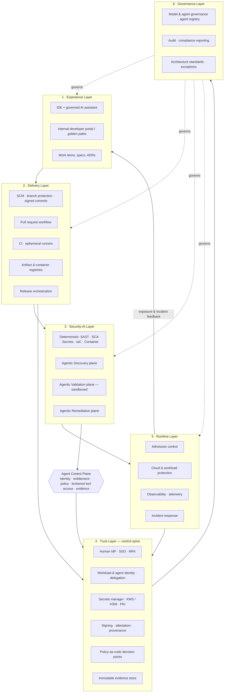
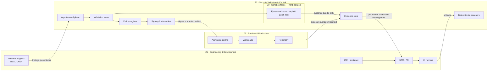
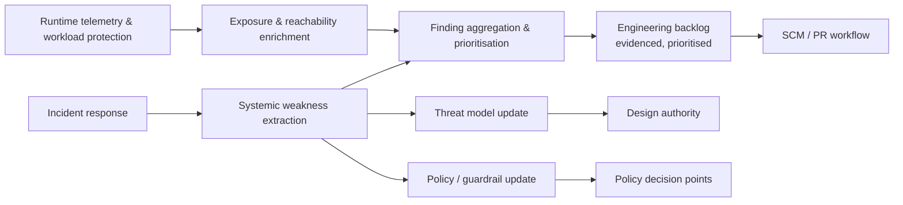
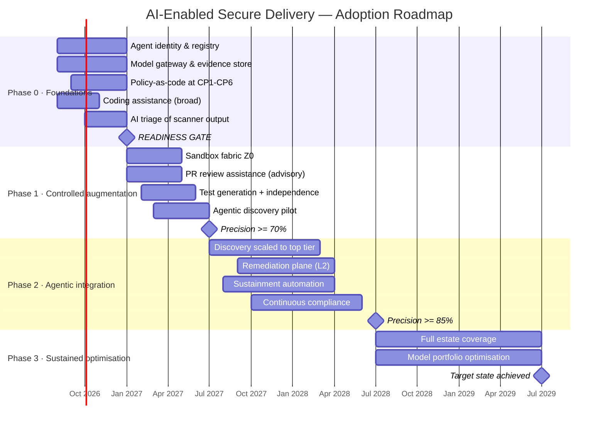

# AI-Enabled Secure Software Delivery — Enterprise Architecture Option Pack

**Document type:** Target-state reference architecture and option pack
**Audience:** Executive stakeholders, Architecture Review Board (ARB), platform engineering, security engineering, delivery teams
**Status:** Draft for architecture and security review
**Version:** 1.0

---

## 1. Executive summary

### 1.1 The proposition

The enterprise already operates a secure SDLC: source control with branch protection, CI/CD pipelines, SAST/SCA scanning, artifact management, change approval and audit evidence capture. That estate was designed on an assumption that is no longer true — that the only entity writing, reviewing and changing code is a named human being.

AI coding assistants have already changed the *production* side of that equation. Agentic security systems are now changing the *verification* side. The consequence is structural, not incremental:

> The pipeline stops being a passive gatekeeper that runs deterministic checks against a submitted change, and becomes an **active verifier** that independently investigates the codebase, forms hypotheses, proves or disproves them, proposes remediation, and submits evidence for human adjudication.

This document defines a target-state architecture for that shift, covering the full lifecycle from demand intake through sustainment, and presents three implementable options (commercial-first, open-source-first, hybrid) with the control model, governance, roadmap and decision criteria required to select and adopt one.

### 1.2 The core architectural argument

Three assertions drive every design decision that follows.

**Assertion 1 — Agent output is an assertion, not a finding.** An agentic system that reports a vulnerability is making a claim. Enterprise architecture must treat that claim as untrusted input until it is validated by a mechanism whose trust properties are independent of the model that produced it. This is why the architecture separates a **Discovery** plane from a **Validation** plane and forbids the same agent identity from operating in both.

**Assertion 2 — Agents are principals, not features.** An agent that opens a pull request, adds a dependency, executes a proof-of-concept exploit or promotes a build is exercising authority. It therefore requires an identity, scoped entitlements, delegation lineage back to a human sponsor, and an audit trail. Bolting agents onto a control model designed for humans and static service accounts produces unattributable change. Agent identity is a **foundation**, not a later phase.

**Assertion 3 — Agents amplify the delivery platform you already have.** Weak CI, thin automated test coverage, manual environment builds and unenforced branch protection are not fixed by agents; they are executed faster and at greater volume. The roadmap in Section 14 therefore sequences **foundations → controlled augmentation → agentic automation**, and treats platform readiness as an admission gate rather than a parallel workstream.

### 1.3 Target state in one paragraph

A layered platform in which a governed **AI and agent services layer** is embedded across every SDLC phase, mediated by an **agent control plane** that issues short-lived scoped workload identities, enforces policy-as-code at every action boundary, and writes immutable evidence to a tamper-evident store. Discovery agents operate read-only against source and build artefacts. Validation agents operate inside ephemeral, egress-controlled sandboxes physically and logically separated from production. Remediation agents produce candidate patches that enter the *standard* pull request workflow with no privileged bypass, carrying machine-readable provenance (SARIF findings, reproduction artefacts, patch rationale, confidence score) so that human reviewers adjudicate evidence rather than re-derive it. Every artefact is signed, attested, SBOM- and AIBOM-described, and admitted to runtime only against policy. Runtime telemetry closes the loop back into the engineering backlog with exploitability context, so remediation priority reflects real exposure rather than raw scanner volume.

### 1.4 Recommendation summary

| # | Recommendation | Rationale |
|---|---|---|
| R1 | Adopt the **hybrid** architecture option (Section 7.3) | Commercial platform for the governed control spine and enterprise-supported scanning; open-source for the agentic research layer where the market has no mature, portable product and lock-in risk is highest |
| R2 | Treat **agent identity and the evidence store as Phase 0** | Every later capability depends on attributable action and durable evidence; retrofitting these is materially more expensive |
| R3 | Enforce **discovery/validation separation** as a non-negotiable principle | Single-agent self-validation is the principal failure mode of agentic security; the entire assurance case rests on this separation |
| R4 | Run agentic discovery **out-of-band first**, not in the PR path | Protects developer flow and change lead time while the false-positive economics are still being calibrated |
| R5 | Measure **validated risk reduction**, never finding volume | Volume metrics reward the exact behaviour — unvalidated finding generation — that destroys reviewer trust and floods the backlog |
| R6 | Codify the **anti-pattern register** (Section 11.3) as ARB review criteria | Makes the failure modes reviewable at design time rather than discoverable at incident time |

### 1.5 What this pack does not do

It does not select products. Section 13 provides weighted decision criteria and a scoring instrument; the scoring exercise itself requires enterprise-specific data (existing licence estate, regulatory scope, platform team capacity) that must be supplied during the ARB process.

---

## 2. Business drivers and goals

### 2.1 Drivers

| ID | Driver | Description | Architectural consequence |
|---|---|---|---|
| D1 | Asymmetry of AI-assisted attack and defence | Adversaries are applying the same automation to vulnerability discovery. Defensive parity requires machine-speed discovery and validation. | Agentic discovery capability with proof-of-exploitability, not signature matching |
| D2 | Code production volume outpacing review capacity | AI assistants increase change throughput; human review capacity is flat. Review becomes the binding constraint. | AI-assisted review that raises reviewer *leverage*; evidence-carrying PRs; risk-tiered review depth |
| D3 | Software supply chain regulatory pressure | SBOM, provenance, attestation and secure-development attestation obligations are expanding across regulated sectors. | Signing, provenance and attestation as mandatory admission controls, not reporting artefacts |
| D4 | Backlog economics of scanner noise | Existing scanners already generate more findings than can be remediated. Adding unvalidated AI findings makes this worse, not better. | Validation and exploitability scoring as a *precondition* of backlog entry |
| D5 | Emerging AI-specific attack surface | Prompt injection via issue descriptions, PR comments and source comments; insecure model endpoints; agent scope creep; poisoned context. | AI governance layer, untrusted-context handling, agent permission boundaries |
| D6 | Cost and concentration risk of frontier models | Uniform use of the largest models across all pipeline stages is economically and strategically fragile. | Model-tiered routing and multi-provider abstraction as an architectural requirement |
| D7 | Auditability of automated decisions | Regulators and internal audit will ask who decided, on what evidence, under what authority. | Immutable evidence chain covering prompt, context, finding, confidence, approval, artefact, deployment |
| D8 | Technical debt and patch latency | Sustainment work competes poorly with feature delivery; exposure windows stay open. | Agentic sustainment (dependency uplift, patch backporting) as a first-class lifecycle capability |

### 2.2 Goals and target outcomes

| Goal | Measure | Baseline | 12-month target | 36-month target |
|---|---|---|---|---|
| G1 Reduce exploitable-defect escape rate | Validated exploitable defects reaching production per 1,000 changes | Establish | −25% | −60% |
| G2 Compress remediation latency | Median time-to-remediate for Critical/High, validated | Establish | −30% | −65% |
| G3 Improve finding precision | Precision of security findings entering the backlog | Establish | ≥70% | ≥90% |
| G4 Raise review leverage | Changes reviewed per reviewer-hour at constant defect escape rate | Establish | +20% | +50% |
| G5 Achieve continuous assurance | % of control evidence auto-generated and audit-acceptable | Ad hoc | 60% | 95% |
| G6 Attributable automation | % of agent actions with scoped identity and delegation lineage | 0% | 100% (in-scope estate) | 100% |
| G7 Reduce sustainment debt | % of estate within N-1 patch currency for critical dependencies | Establish | +25pp | +55pp |

### 2.3 Explicit non-goals

- **Removing humans from security decisions.** The target state increases human decision *quality* and *leverage*; it does not remove accountability. Approval of production change, exploit execution, dependency introduction and security-relevant fixes remains human.
- **Replacing deterministic analysis.** SAST, SCA, secrets and IaC scanning remain the high-recall, low-cost, reproducible base layer. Agentic capability is additive and targeted at classes those tools structurally cannot reach (logic flaws, race conditions, multi-step exploit chains, cross-component reachability).
- **Full autonomy in production.** Not in scope at any point in the 36-month horizon.

---

## 3. Architecture principles

Each principle is stated with its rationale and — critically — its **testable implication**, so the ARB can assess conformance rather than intent.

| ID | Principle | Rationale | Testable implication |
|---|---|---|---|
| P1 | **Secure by design, secure by default** | Controls that require opt-in are not controls. | A new repository inherits branch protection, scanning, signing and policy admission with zero configuration. Non-conformance is detectable by platform inventory query. |
| P2 | **Agents are first-class principals** | Unattributable automated change is unauditable. | Every agent action in audit logs resolves to a unique workload identity, a scoped entitlement set, and a human delegator. No shared or long-lived agent credentials exist. |
| P3 | **Separation of discovery and validation** | A model that both proposes and confirms a finding provides no independent evidence. | The identity that produced a finding cannot sign its validation. Enforced at the control plane, not by convention. |
| P4 | **Least privilege, ephemeral by default** | Standing agent privilege is a standing breach. | No agent holds a credential with lifetime > the task. Sandboxes are created per task and destroyed after evidence extraction. |
| P5 | **Untrusted context** | Issue text, PR comments, source comments, dependency READMEs and web content are attacker-controllable inputs to agents. | Context entering an agent is classified by trust tier; instructions originating from untrusted tiers cannot alter agent scope or entitlements. |
| P6 | **Evidence over assertion** | Trust in automation is earned through reproducible artefacts. | Every finding admitted to the backlog carries a reproduction artefact or an explicit, reviewed "unproven" flag with a lower default severity. |
| P7 | **No privileged path** | AI tooling that bypasses PR, review or release controls destroys the control model it operates within. | Agent-authored changes traverse the identical PR, review, scan, sign and release path as human-authored changes. Zero exemptions. |
| P8 | **Human accountability at irreversible boundaries** | Automation may prepare a decision; a person owns it. | Production promotion, exploit execution against non-trivial targets, new dependency introduction and security-fix merge each require a named human approval recorded in evidence. |
| P9 | **Policy as code, evaluated at the boundary** | Documented policy that is not machine-evaluated is aspiration. | Every control point calls a policy decision point; deny is the default on evaluation failure (fail-closed for security controls). |
| P10 | **Model and vendor pluggability** | Model capability and cost move faster than enterprise procurement cycles. | Swapping a model provider for any pipeline stage requires configuration change only; no stage embeds provider-specific logic. |
| P11 | **Deterministic base, probabilistic augmentation** | Probabilistic tooling must not become the sole source of assurance for a control. | No compliance control has an agentic system as its only evidence source. Every control has a deterministic fallback. |
| P12 | **Isolation of adversarial execution** | Reproduction and exploit validation execute attacker-shaped code. | Validation sandboxes have no network path to production, no production credentials, no shared state, and are destroyed after use. |
| P13 | **Provenance is unbroken** | Supply chain assurance is only as strong as its weakest unattested hop. | Every artefact admitted to any environment has a verifiable chain from source commit through build to signature and attestation. |
| P14 | **Composability over monolith** | Single-vendor end-to-end platforms trade integration cost for strategic lock-in. | Interfaces between planes use open formats (SARIF, SPDX/CycloneDX, in-toto, OpenTelemetry, OCI). Component replacement is a bounded project. |
| P15 | **Measure outcomes, not activity** | Volume metrics incentivise the failure mode. | No team or platform KPI counts findings generated, lines suggested or agent invocations. |

---

## 4. High-level capability map across the lifecycle

### 4.1 Lifecycle capability model

Fourteen capability areas, each shown with its AI/agentic contribution, the human accountability that remains, and the control point that governs it.

| # | Capability area | AI / agentic contribution | Human remains accountable for | Governing control point |
|---|---|---|---|---|
| C1 | Business demand intake & requirements | Requirement decomposition, ambiguity and testability analysis, automatic derivation of security and privacy requirements from data classification and regulatory scope | Accepting requirements; risk appetite; scope | Requirement baseline approval |
| C2 | Threat modelling & secure design | Draft threat models from architecture and code; trust-boundary extraction; control mapping; design-drift detection against approved model | Threat model sign-off; residual risk acceptance | Design authority gate |
| C3 | Developer enablement & coding assistance | In-IDE secure coding assistance, context-grounded secure patterns, inline explanation of findings, secure-by-default scaffolding | Code authorship; understanding what was accepted | Commit signing; assistant policy profile |
| C4 | Secure code review & PR governance | Risk-tiered review triage, security-focused review commentary, change-impact and blast-radius analysis, evidence summarisation for reviewers | Merge decision; review quality | Branch protection; required reviewers |
| C5 | Dependency, package, secrets & IaC scanning | Deterministic scanning augmented by AI triage, reachability analysis, exploitability context and false-positive suppression rationale | Exception approval; risk acceptance | Policy gate on PR and build |
| C6 | Agentic vulnerability discovery & exploit validation | Multi-agent repository analysis, hypothesis generation, cross-model adjudication, sandboxed reproduction, PoC generation, deduplication, confidence scoring | Authorising execution; adjudicating disputed findings; disclosure decisions | Sandbox authorisation; finding admission gate |
| C7 | Build, artifact, provenance & signing | Build config analysis, SBOM/AIBOM generation and enrichment, provenance anomaly detection | Key custody; trust root governance | Signing service; attestation policy |
| C8 | Test generation, quality & security regression | Test synthesis, coverage-gap targeting, regression test generation from each validated finding, mutation-informed adequacy assessment | Test strategy; acceptance of coverage adequacy | Independent quality gate |
| C9 | Deployment approval, release orchestration, promotion | Release risk scoring, change-collision detection, evidence pack assembly for approvers, rollback readiness assessment | Production go/no-go | Release approval gate |
| C10 | Runtime monitoring, workload protection, anomaly detection | Behavioural anomaly detection, exploitability enrichment from runtime exposure, alert correlation and narrative construction | Incident declaration; containment authority | Runtime admission & response policy |
| C11 | Incident response feedback into backlog | Root-cause pattern extraction, systemic-weakness identification across the estate, automatic backlog item generation with reproduction | Prioritisation; systemic remediation commitment | Post-incident review |
| C12 | Technical debt, patching, sustainment | Autonomous dependency uplift PRs, patch backporting, deprecated-API migration, EOL exposure mapping | Merge and release of sustainment change | Standard PR + release gates |
| C13 | Continuous compliance, evidence & audit | Continuous control monitoring, evidence collection and normalisation, narrative generation for audit, gap detection | Attestation and sign-off to regulators | Evidence store integrity; auditor access |
| C14 | AI governance, model risk, agent control | Agent behaviour monitoring, drift and scope-creep detection, prompt-injection detection, cost and model-routing optimisation | Model approval; agent authorisation; risk acceptance | AI governance board; agent registry |

### 4.2 Capability heat map — value versus enterprise readiness

Assessment as at the current market state. "Readiness" reflects productisation, supportability and control maturity — not technical potential.

| Capability | Value potential | Enterprise readiness | Adoption posture |
|---|---|---|---|
| C3 Coding assistance | High | High | Scale now, with policy profile |
| C5 Scanning + AI triage | High | High | Scale now |
| C8 Test generation | High | Medium-High | Scale now, with independence controls |
| C12 Sustainment automation | High | Medium-High | Pilot now, scale in Phase 2 |
| C4 PR review assistance | High | Medium | Pilot, advisory-only initially |
| C13 Continuous compliance | High | Medium | Pilot on a subset of controls |
| C9 Release risk scoring | Medium | Medium | Advisory-only |
| C1 Requirements | Medium | Medium | Low-risk, low-effort pilot |
| C2 Threat modelling | High | Medium-Low | Pilot; draft-only, human-authored sign-off |
| C10 Runtime anomaly detection | High | Medium | Vendor-dependent; assess in place |
| C11 IR feedback loop | Medium | Medium-Low | Manual-assisted first |
| C6 Agentic discovery & validation | Very High | Low-Medium | Controlled pilot on high-value targets only |
| C14 AI/agent governance | Critical (enabler) | Low | **Build first** — no product substitutes for it |

The two entries that matter strategically are the last two. C6 carries the highest value and the lowest readiness — which is precisely why it must be piloted narrowly, under strong isolation, rather than deployed broadly. C14 is the enabler with no mature market answer; the enterprise must build it, and must build it before C6.

### 4.3 Capability map — visual

```mermaid
flowchart LR
  subgraph PLAN["Plan & Design"]
    C1["C1 Demand & Requirements"]
    C2["C2 Threat Model & Design"]
  end
  subgraph BUILD["Build"]
    C3["C3 Coding Assistance"]
    C4["C4 Review & PR Governance"]
    C5["C5 SAST / SCA / Secrets / IaC"]
  end
  subgraph VERIFY["Verify"]
    C6["C6 Agentic Discovery & Validation"]
    C8["C8 Test Generation & Regression"]
  end
  subgraph RELEASE["Release"]
    C7["C7 Build, Provenance & Signing"]
    C9["C9 Approval & Promotion"]
  end
  subgraph RUN["Run & Sustain"]
    C10["C10 Runtime Protection"]
    C11["C11 IR Feedback"]
    C12["C12 Patching & Sustainment"]
  end
  subgraph GOV["Govern — spans all phases"]
    C13["C13 Continuous Compliance & Evidence"]
    C14["C14 AI & Agent Governance"]
  end

  PLAN --> BUILD --> VERIFY --> RELEASE --> RUN
  RUN -- "findings, incidents, exposure context" --> PLAN
  GOV -.-> PLAN
  GOV -.-> BUILD
  GOV -.-> VERIFY
  GOV -.-> RELEASE
  GOV -.-> RUN
```



---

## 5. High-level reference blueprint

### 5.1 Narrative summary (one-page style)

The platform is organised as six horizontal layers, cut by three vertical trust zones and governed by a single control plane.

**Experience layer** is where engineers work: IDEs with governed AI assistance, the internal developer portal, work-item and specification management, and the golden-path templates that make the secure route the easy route. Nothing here is trusted for control purposes; it is optimised for flow.

**Delivery layer** is the system of record for change: source control with enforced branch protection and signed commits, pull request workflow, CI pipelines and ephemeral runners, artifact repositories, and release orchestration. This layer holds the authoritative history of what changed and who approved it.

**Security-AI layer** is where analysis happens. It has a deliberate internal split: a *deterministic* sub-layer (SAST, SCA, secrets, IaC, container and licence scanning) providing high-recall, reproducible, cheap coverage; and an *agentic* sub-layer (repository analysis, hypothesis generation, cross-model adjudication, sandboxed reproduction, patch synthesis) providing depth on classes the deterministic tools structurally cannot reach. The agentic sub-layer is further split into Discovery, Validation and Remediation planes that do not share identities.

**Trust layer** is the control spine: SSO and human identity, workload identity federation, agent identity and delegation, secrets management, KMS/HSM, certificate services, code and artifact signing, attestation, policy-as-code decision points, and the immutable evidence store. Every action in every other layer that has security significance transits this layer.

**Runtime layer** is production and its neighbours: cloud and workload protection, admission control, observability, runtime exposure and reachability data, and incident response. Its most architecturally significant function is not protection but *feedback* — it supplies the exposure context that converts a theoretical finding into a prioritised one.

**Governance layer** spans everything: model and agent governance, the agent registry, AI risk management, audit and compliance reporting, architecture standards and the exception process.

The **agent control plane** is the mediating component. No agent talks directly to source control, a model provider, a sandbox, a secret or an artifact repository. Every such interaction is brokered: identity issued, entitlements resolved, policy evaluated, action executed, evidence written. This is the single most important structural decision in the blueprint, because it is what makes agent behaviour governable, attributable, revocable and observable from one place.

### 5.2 Layered architecture model



### 5.3 Critical control objectives

The blueprint is only defensible if these fifteen objectives hold. They are the ARB's conformance checklist.

| ID | Control objective | Where enforced |
|---|---|---|
| CO-01 | Every human and non-human actor has a unique, attributable identity | Trust layer — IdP, workload identity |
| CO-02 | Every agent action traces to a scoped entitlement and a human delegator | Agent control plane |
| CO-03 | No credential used by an agent outlives its task | Secrets manager, workload identity federation |
| CO-04 | Source change requires signed commits and protected-branch review | Delivery layer |
| CO-05 | Agent-authored change traverses the standard PR path with no exemption | Delivery layer + policy |
| CO-06 | Discovery and validation are performed under separate identities | Agent control plane (structural) |
| CO-07 | Adversarial execution occurs only in isolated, egress-controlled, ephemeral sandboxes | Validation plane |
| CO-08 | Every artifact is signed, attested and SBOM/AIBOM-described | Build + signing service |
| CO-09 | Runtime admission requires signature, attestation and policy pass | Admission control |
| CO-10 | Secrets never enter model context, logs, prompts or evidence records | Secrets scanning + context filter + redaction at evidence write |
| CO-11 | Untrusted context cannot alter agent scope, entitlements or tool access | Agent control plane + context trust tiering |
| CO-12 | Production promotion requires a named human approval, recorded | Release gate |
| CO-13 | Evidence is immutable, time-stamped, complete and independently verifiable | Evidence store (WORM + hash chain) |
| CO-14 | Every model and agent in use is registered, approved, versioned and monitored | Agent registry / AI governance |
| CO-15 | Every security control has a deterministic evidence source independent of AI | Compliance architecture |

### 5.4 Architecture options — executive summary

| | Commercial-first | Open-source-first | **Hybrid (recommended)** |
|---|---|---|---|
| Time to value | Fastest | Slowest | Fast for core, staged for agentic |
| Platform team effort | Low-Medium | Very High | Medium |
| Lock-in exposure | High | Low | Medium, deliberately bounded |
| Agentic capability access | Vendor roadmap-bound; preview programmes | Immediate but unsupported | Best available in each domain |
| Control-model fit | Good, but vendor-shaped | Excellent, if built | Excellent — enterprise owns the control plane |
| Regulated-environment fit | Good, subject to data residency and provider terms | Excellent for sovereignty; weak on supportability | Strong |
| Run cost profile | Licence-heavy, predictable | Labour-heavy, less predictable | Mixed, manageable |
| Principal risk | Strategic dependence; control model shaped by vendor | Sustained engineering burden; key-person risk | Integration complexity; requires a real platform team |

---

## 6. Next-level-down logical architecture

### 6.1 Trust zones

Three primary zones plus one that is easy to omit and expensive to omit.

| Zone | Name | Purpose | Contains | Ingress rule | Egress rule |
|---|---|---|---|---|---|
| **Z1** | Engineering & Development | Authoring and integration of change | IDEs, SCM, PR workflow, CI runners, dev artifact repos, coding assistants, discovery agents (read-only) | Authenticated human/workload identity via IdP | May publish artefacts to Z2; may not reach Z3 |
| **Z2** | Security Validation & Control | Independent analysis, adversarial execution, policy decision, evidence custody | Deterministic scanners, validation plane, sandbox fabric, policy engines, signing service, evidence store, agent control plane | Artefacts and findings from Z1; telemetry from Z3 | Signed attestations and policy decisions only |
| **Z3** | Runtime & Production | Execution of released software | Production clusters, data stores, admission control, workload protection, observability | Signed, attested, policy-passed artefacts only | Telemetry and incident data to Z2 |
| **Z0** | Sandbox Fabric (sub-zone of Z2, hard-isolated) | Execution of untrusted and adversarial code | Ephemeral reproduction/exploit/patch-test environments | Target source + build artefacts + synthetic data only | Structured evidence bundle only; no network egress; no shared filesystem |

**The Z0 rule is the one that must not be negotiated.** Reproduction, exploit validation and patch testing execute attacker-shaped code by design. Z0 has no production credentials, no production network path, no persistent storage, no real customer data, and is destroyed after evidence extraction. Enterprises that fold Z0 into general CI infrastructure — because "the runners are already there" — have created an adversarial execution capability inside their build estate.



### 6.2 Component catalogue

For each component: purpose, security relevance, required integrations, minimum control requirements, and whether human approval is required.

#### 6.2.1 Experience and delivery components

| Component | Purpose | Security relevance | Required integrations | Minimum controls | Human approval? |
|---|---|---|---|---|---|
| Source control (SCM) | System of record for code and history | Root of provenance chain; primary target for unauthorised change | IdP, signing, CI, policy engine, evidence store | Enforced branch protection; signed commits; no force-push on protected refs; CODEOWNERS; full audit export | Merge to protected branch: **Yes** |
| Pull request workflow | Change adjudication surface | Where agent output meets human accountability | SCM, scanners, agent control plane, policy engine | Required status checks; required reviewers by risk tier; agent-authored PRs labelled and attributed; no self-approval by any identity | **Yes** |
| Issue / work-item tracker | Demand and finding backlog | **Untrusted input surface** — prompt-injection vector via issue and comment text | SCM, evidence store, agent control plane | Content from external/anonymous reporters tagged untrusted; agents cannot act on instructions sourced from issue text | Prioritisation: **Yes** |
| Internal developer portal | Golden paths, service catalogue, ownership | Ensures secure defaults are the default | SCM, CI, policy, inventory | Template provenance; ownership metadata mandatory for every service | Template publication: **Yes** |
| Specification / ADR repository | Durable design intent | Grounding context for agents; drift-detection baseline | SCM, threat model store | Versioned, reviewed, linked to threat models | ADR acceptance: **Yes** |
| IDE coding assistant | In-flow secure coding help | Introduces code of uncertain provenance; potential context leakage | IdP, policy profile, telemetry, model gateway | Enterprise tenancy; no training on enterprise code; context exclusion for secrets/regulated data; per-repo policy profile; usage telemetry | No (author accountable) |
| CI runners | Build and test execution | High-value target; credential concentration point | Workload identity, secrets manager, artifact repo | Ephemeral; no standing credentials; OIDC federation to cloud; egress allowlist; no interactive access | No |
| Artifact & container registries | Custody of build outputs | Supply chain integrity anchor | Signing, attestation, policy, admission control | Immutable tags; signature required for promotion; retention and provenance metadata; vulnerability re-scan on stored artefacts | Promotion between tiers: **Yes** |
| Release orchestration | Environment promotion | Enforces the last gate before production | Policy engine, evidence store, IdP, admission control | Segregation of duties (author ≠ approver); evidence pack assembled and displayed at approval; emergency path logged and reviewed | Production: **Yes** |

#### 6.2.2 Security-AI components

| Component | Purpose | Security relevance | Required integrations | Minimum controls | Human approval? |
|---|---|---|---|---|---|
| SAST engine | Deterministic code analysis | High-recall base layer; independent of AI | SCM, PR, policy, evidence | Runs on every PR; findings in SARIF; suppression requires documented, expiring, approved exception | Exception: **Yes** |
| SCA / dependency analysis | Known-vulnerability and licence exposure | Supply chain risk surface | SCM, artifact repo, SBOM, policy | Reachability analysis where available; blocking policy by severity and exploit status; allowlist for new dependencies | New dependency: **Yes** |
| Secrets scanning | Prevent and detect credential exposure | Prevents catastrophic disclosure; guards agent context | SCM (pre-receive), CI, secrets manager, evidence | Pre-commit and pre-receive enforcement; automatic revocation workflow on detection; scanning of agent context and evidence records | Revocation: automated, notified |
| IaC / policy scanning | Infrastructure misconfiguration prevention | Prevents insecure environments | SCM, CI, policy engine, cloud posture | Blocking on Critical/High; drift detection against deployed state | Exception: **Yes** |
| Model gateway | Single brokered egress to all model providers | Prevents shadow AI; enforces data handling; enables model portability | Agent control plane, IdP, evidence, DLP | All model traffic transits gateway; per-route model tiering; prompt/response logging with redaction; provider allowlist; no direct provider network egress from any other component | No |
| **Agent orchestration layer** | Executes multi-stage agentic workflows | The engine of C6; where staged analysis is coordinated | Model gateway, agent control plane, sandbox fabric, SCM (read), evidence | Declarative, versioned, reviewed workflow definitions; per-stage identity; stage-level entitlement; deterministic replay of decisions from evidence | Workflow publication: **Yes** |
| **Discovery plane** | Repository analysis, hypothesis generation, candidate findings | Produces *assertions*, not findings | SCM (read-only), model gateway, evidence | Read-only source access; no write path anywhere; no sandbox execution rights; output is always "candidate" status | No |
| **Validation plane** | Reproduction, PoC generation, cross-model adjudication, deduplication, confidence scoring | Converts assertion to evidence; the trust-creating step | Sandbox fabric, model gateway, evidence, ticketing | **Identity distinct from discovery**; adjudication uses a model family different from the proposing model; reproduction artefact required for "proven" status; confidence recorded with method | Exploit execution beyond trivial repro: **Yes** |
| **Remediation plane** | Candidate patch generation and pre-validation | Produces change; highest-authority agentic function | Sandbox fabric, SCM (branch write only), CI, evidence | Cannot write to protected branches; cannot approve its own PR; patch must pass regression suite in sandbox before PR is opened; patch rationale and diff-of-behaviour attached | Merge: **Yes** |
| Test generation service | Coverage and regression test synthesis | Guards against agent-written code being validated only by agent-written tests | SCM, CI, coverage tooling | Regression test mandatory for every validated finding; **independence rule** — tests for agent-authored code are generated by a separate identity/model and reviewed by a human; mutation testing on critical modules to detect vacuous tests | Test acceptance in critical paths: **Yes** |
| Finding aggregation & triage | Single normalised view of all findings | Prevents duplicate and contradictory backlogs | All scanners, all agent planes, runtime, ticketing, evidence | SARIF normalisation; cross-source deduplication; exploitability enrichment from runtime; single severity model | Severity override: **Yes** |

#### 6.2.3 Trust layer components

| Component | Purpose | Security relevance | Required integrations | Minimum controls | Human approval? |
|---|---|---|---|---|---|
| Human identity provider | Authenticate people | Root of human accountability | Everything | Phishing-resistant MFA; conditional access; privileged access management for approvers | Role grant: **Yes** |
| Workload identity federation | Authenticate non-human workloads | Eliminates long-lived credentials | CI, cloud, agent control plane | OIDC federation; no static cloud keys anywhere in the pipeline; short-lived tokens only | No |
| **Agent identity & delegation service** | Issue scoped, time-bound, attributable agent identities | **The keystone control** — makes agentic action governable | IdP, agent control plane, policy engine, evidence | Per-task identity; entitlement set explicit and minimal; delegation chain to a named human sponsor recorded; instant revocation; no shared agent credentials; identity cannot self-escalate | Entitlement expansion: **Yes** |
| Secrets manager | Custody and brokered issuance of secrets | Prevents credential sprawl into code, logs and prompts | CI, runtime, agent control plane | Dynamic/short-lived secrets preferred; per-workload scoping; full access audit; secrets never resolvable by discovery or validation planes | Static secret creation: **Yes** |
| KMS / HSM | Key custody | Root of trust for signing and encryption | Signing service, PKI, secrets manager | Hardware-backed keys for signing roots; dual control for root operations; key ceremony documented | Root key ops: **Yes (dual)** |
| Certificate services / PKI | Workload and code-signing certificates | Identity and integrity foundation | KMS, workload identity, signing | Short-lived workload certs; automated rotation; CRL/OCSP available | CA operations: **Yes** |
| Code & artifact signing service | Bind identity to artefacts | Provenance and tamper evidence | CI, KMS, artifact repo, policy | Keyless/short-lived signing preferred; signing only from authorised pipelines; signature verification at every promotion hop | No (policy-driven) |
| Attestation & provenance service | Record verifiable build facts | Enables "how was this built" to be answered mechanically | CI, signing, policy, admission | Provenance generated at build (SLSA-style); SBOM and AIBOM attached as attestations; verification enforced at admission | No |
| Policy decision points (policy-as-code) | Evaluate policy at every control point | Makes policy enforceable and testable | SCM, CI, registry, release, admission, agent control plane | Policies versioned in Git and reviewed; fail-closed for security controls; decision logs to evidence; policy change requires the same PR rigour as code | Policy change: **Yes** |
| **Evidence store** | Immutable custody of the decision record | The audit and assurance foundation | Everything | Append-only/WORM; hash-chained; time-stamped; retention per regulatory scope; redaction of secrets at write; independently verifiable; queryable by auditors without engineering assistance | Retention change: **Yes** |

#### 6.2.4 Runtime and governance components

| Component | Purpose | Security relevance | Required integrations | Minimum controls | Human approval? |
|---|---|---|---|---|---|
| Admission control | Gate on what may run | Last enforcement point before execution | Signing, attestation, policy | Deny unsigned, unattested, or policy-failing artefacts; break-glass logged and reviewed within 24h | Break-glass: **Yes** |
| Cloud & workload protection | Detect and prevent runtime attack | Compensating control for what shifted left | Telemetry, IR, finding aggregation | Runtime exposure data fed to finding prioritisation; workload behavioural baselines | No |
| Observability / telemetry | Operational and security visibility | Source of truth for exposure and behaviour | Everything runtime; evidence store | Structured, correlatable, retained per policy; agent actions carry the same telemetry schema as human actions | No |
| Incident response platform | Manage detection to resolution | Closes the loop to engineering | Telemetry, ticketing, evidence, backlog | Systemic-weakness extraction mandatory in post-incident review; backlog items generated with reproduction where possible | Incident closure: **Yes** |
| **Agent registry** | Inventory of every agent, its purpose, entitlements, models, owner, version | Without it there is no AI governance, only AI hope | Agent control plane, AI governance, evidence | Registration mandatory before any agent may obtain an identity; periodic recertification; deregistration revokes identity | Registration: **Yes** |
| Model governance | Approve, version and monitor models in use | Model risk management | Model gateway, agent registry, evidence | Approved-model list; evaluation before approval; change notification from providers; rollback plan per model | Model approval: **Yes** |
| Compliance & audit reporting | Continuous control monitoring and reporting | Converts evidence into assurance | Evidence store, policy, inventory | Control-to-evidence mapping maintained; auto-generated reports reviewed by a human before external submission | External attestation: **Yes** |

### 6.3 Core data flows

#### 6.3.1 Flow A — Finding lifecycle (discovery → evidence → backlog)

```mermaid
sequenceDiagram
  participant D as Discovery plane (Z1, read-only)
  participant ACP as Agent control plane (Z2)
  participant V as Validation plane (Z2)
  participant S as Sandbox Z0
  participant AG as Finding aggregation
  participant H as Human security engineer
  participant E as Evidence store

  D->>ACP: candidate assertion + rationale + context refs
  ACP->>E: record assertion, identity, prompt hash, model, timestamp
  ACP->>V: dispatch for validation (separate identity)
  V->>V: cross-model adjudication (different model family)
  V->>S: request reproduction in ephemeral sandbox
  S-->>V: reproduction artefact OR failure to reproduce
  V->>E: validation result, confidence, method, artefact hash
  alt Proven exploitable
    V->>AG: PROVEN finding + reproduction + severity
    AG->>AG: deduplicate, enrich with runtime exposure
    AG->>H: prioritised item with evidence pack
    H->>E: adjudication decision (accept / reject / defer)
  else Not reproduced
    V->>AG: UNPROVEN — severity capped, sampled for human review
    AG->>E: record with reason; feed precision metrics
  end
```

**Design point:** the "UNPROVEN" branch is not a discard path. It is a *sampled* path. Discarding unproven findings silently destroys the data needed to measure and improve precision, and hides systematic blind spots. A fixed sample is human-reviewed and the results feed the precision metric in Section 12.

#### 6.3.2 Flow B — Remediation (fix → PR → merge → release)

```mermaid
sequenceDiagram
  participant AG as Finding aggregation
  participant R as Remediation plane
  participant S as Sandbox Z0
  participant T as Test generation (separate identity)
  participant SCM as SCM / PR
  participant CI as CI + scanners
  participant HR as Human reviewer (CODEOWNER)
  participant REL as Release gate
  participant E as Evidence store

  AG->>R: PROVEN finding + reproduction artefact
  R->>S: generate candidate patch; verify repro no longer succeeds
  S-->>R: patch + before/after behaviour evidence
  R->>T: request regression test for this finding
  T-->>R: regression test (independent identity/model)
  R->>SCM: open PR on feature branch — agent identity, labelled
  Note over R,SCM: Agent cannot write protected branches<br/>Agent cannot approve any PR
  SCM->>CI: standard required checks — no exemptions
  CI->>SCM: SAST/SCA/secrets/IaC/tests results
  SCM->>HR: review request with full evidence pack
  HR->>SCM: approve / request changes / reject
  SCM->>E: merge record, approver identity, evidence refs
  SCM->>REL: build, sign, attest, promote
  REL->>E: named human production approval
```

#### 6.3.3 Flow C — Runtime feedback into engineering



The architectural value of this flow is prioritisation integrity. A Critical finding in an unreachable code path in a non-internet-facing service is not a Critical operational risk. Without runtime enrichment, agentic discovery makes the backlog *worse* by adding volume without context.

### 6.4 Human-in-the-loop checkpoints

| # | Checkpoint | Trigger | Approver role | Cannot be delegated to an agent | Evidence recorded |
|---|---|---|---|---|---|
| H1 | Requirement and risk baseline | New system / major change | Product owner + security architect | Yes | Baseline record, signatories |
| H2 | Threat model sign-off | Design complete or material design change | Security architect | Yes | Model version, residual risk acceptance |
| H3 | New dependency admission | Any new third-party package | Tech lead + supply chain policy | Yes | Package, version, justification, licence, provenance |
| H4 | Exploit execution authorisation | PoC beyond trivial reproduction, or any target with shared infrastructure | Security engineering manager | Yes | Scope, target, sandbox ID, time window |
| H5 | Disputed finding adjudication | Discovery and validation disagree, or developer contests | Security engineer | Yes | Decision, rationale, precision-metric input |
| H6 | Security fix merge | Any PR remediating a security finding | CODEOWNER (human) | Yes | Approver, evidence pack reference |
| H7 | Exception / suppression | Any control bypass or finding suppression | Risk owner | Yes | Scope, compensating control, **mandatory expiry** |
| H8 | Production promotion | Any deployment to production | Release approver, separate from author | Yes | Approver, evidence pack, change record |
| H9 | Break-glass | Emergency bypass of admission or gate | On-call authority; reviewed within 24h | Yes | Full action log, retrospective review outcome |
| H10 | Agent registration & entitlement grant | New agent or expanded scope | AI governance board | Yes | Purpose, entitlements, sponsor, models, expiry |
| H11 | Model approval | New or updated model into an approved route | AI governance board | Yes | Evaluation results, data-handling terms, rollback plan |
| H12 | External disclosure | Reporting a finding outside the enterprise | Security leadership + legal | Yes | Finding, validation status, disclosure decision |

**H12 deserves emphasis.** Agentic discovery run against open-source dependencies will produce findings in code the enterprise does not own. Submitting unvalidated AI-generated vulnerability reports to upstream maintainers is a reputational and community-relations hazard that maintainers have publicly and repeatedly objected to. Enterprise policy must require human validation before any external submission — no exceptions, no automation.

### 6.5 Failure modes and compensating controls

| # | Failure mode | Likelihood | Impact | Compensating controls |
|---|---|---|---|---|
| F1 | Hallucinated vulnerability enters backlog as real | High | Medium — wasted capacity, eroded trust | Mandatory reproduction for PROVEN status; capped severity for UNPROVEN; precision metric with team-visible reporting; sampled human review |
| F2 | Real vulnerability dismissed as false positive | Medium | High — false assurance | Deterministic scanners retained as independent layer; sampled review of dismissals; recall benchmarking against historical known-issue corpus |
| F3 | Prompt injection via issue text, PR comment or source comment redirects an agent | Medium | High — unauthorised action | Context trust tiering; entitlements resolved by control plane, never by agent reasoning; instructions from untrusted tiers cannot alter scope; anomaly detection on agent tool-call patterns |
| F4 | Agent credential compromise or misuse | Low-Medium | Very High | Per-task ephemeral identity; minimal entitlements; instant revocation; behavioural monitoring; no standing privilege |
| F5 | Sandbox escape from exploit validation | Low | Very High | Z0 hard isolation; no production network path; no production credentials; ephemeral infrastructure; independent monitoring of Z0 boundary |
| F6 | Agent-written tests validate agent-written code vacuously | High | High — false assurance | Independence rule (separate identity/model for tests); mutation testing on critical modules; human review of tests in critical paths; coverage-quality metrics not coverage-percentage metrics |
| F7 | Model provider outage or deprecation | Medium | Medium | Model gateway abstraction; multi-provider routing; graceful degradation to deterministic-only mode; documented capability loss per provider |
| F8 | Cost overrun from unbounded agentic execution | High | Medium | Per-workflow token and wall-clock budgets; model tiering by stage; scheduled rather than continuous deep scans; cost attribution to owning team |
| F9 | Evidence gap breaks the audit chain | Medium | High | Fail-closed on evidence write failure for gated actions; evidence completeness monitoring; periodic chain verification |
| F10 | Shadow AI usage outside the model gateway | High | High — data leakage | Network egress control to provider endpoints; DLP; approved-tool catalogue that is genuinely better than the alternatives; usage telemetry and periodic attestation |
| F11 | Agent introduces a malicious or typosquatted dependency | Low-Medium | Very High | Dependency allowlist; human approval for all new packages (H3); provenance verification; internal proxy registry only |
| F12 | Silent degradation after a model update | Medium | High | Golden-set regression evaluation on every model version change; canary routing; precision/recall monitoring with alerting on drift |
| F13 | Alert and PR volume overwhelms review capacity | High | Medium-High | Out-of-band discovery before in-band; rate limiting on agent-generated PRs per repo per period; risk-tiered review; strict prioritisation by exploitability |
| F14 | Over-reliance — reviewers rubber-stamp agent output | Medium-High | High | Rotate independent human review samples; measure reviewer-caught defect rate; never present agent confidence as a merge recommendation; deliberate friction on high-risk merges |

**F14 is the failure mode with the weakest technical mitigation.** It is cultural, it emerges slowly, and it is invisible in the metrics that most organisations collect. It should be an explicit standing agenda item for the governance forum in Section 10, with a measured indicator (reviewer-caught defect rate) rather than an assumed one.

### 6.6 Enterprise integration assumptions

| Assumption | Consequence if false |
|---|---|
| A single SCM platform holds ≥90% of in-scope code | Discovery coverage fragments; per-platform integration cost multiplies |
| An enterprise IdP supports workload identity federation and OIDC | Agent identity model requires a bespoke build; Phase 0 extends materially |
| CI is centralised on ≤2 platforms | Policy enforcement becomes per-team convention rather than platform control |
| A policy-as-code engine is deployable at all six control points | Enforcement becomes partial; the control model degrades to advisory |
| An evidence store with WORM semantics is available or procurable | Audit chain integrity cannot be asserted; regulatory position weakens |
| Approved model routes exist with acceptable data-handling terms for the regulatory scope | Agentic capability is limited to self-hosted models; capability ceiling drops |
| A platform engineering team of sufficient capacity exists | The open-source-first option becomes non-viable; hybrid becomes the floor, not the choice |
| Network egress from build and validation zones is controllable | Shadow AI and exfiltration controls cannot be enforced |

---

## 7. Architecture option pack

Three coherent options. Each is internally consistent; the failure mode in practice is mixing them accidentally rather than deliberately.

### 7.1 Option A — Commercial-first

**Shape.** A primary vendor ecosystem supplies SCM, CI, code scanning, artifact management, runtime protection and the agentic discovery capability, integrated natively and consumed as managed service. The enterprise configures and governs; it does not build.

| Dimension | Assessment |
|---|---|
| Agentic capability source | Vendor productised agentic scanning, typically via preview or eligibility programme, integrated with the vendor's own code security and runtime products |
| Integration effort | Low — native, vendor-maintained |
| Time to first value | 3–6 months |
| Platform team size | Small (configuration and governance focus) |
| Control model | Strong within the ecosystem; weaker at its edges and for non-conforming estate |
| Evidence model | Vendor-provided, vendor-shaped; export fidelity must be verified before commitment |
| Data residency | Vendor-dependent; a first-order constraint in regulated and sovereign environments |
| Cost profile | Licence-dominant, predictable, scales with seats and repositories |

**Benefits.** Fastest route to capability. Supported, with an accountable vendor and a roadmap. Native code-to-runtime correlation is genuinely difficult to build and is increasingly available as a productised integration — connecting runtime exposure context to findings developers already see in their pull requests. Lower key-person risk. Procurement and assurance processes are familiar.

**Risks.** Strategic dependence: the control model becomes vendor-shaped, and the agent identity model in particular may not extend to non-vendor agents. Capability access is roadmap- and eligibility-bound rather than demand-driven. Preview-stage capabilities carry no general-availability or pricing commitment, which complicates business-case certainty. Exit cost rises steeply once evidence and policy live inside vendor formats.

**Enterprise readiness.** High for the deterministic and platform layers. Medium for the agentic layer, which in most vendor offerings remains in expanded-preview status with restricted eligibility.

**Best fit.** Enterprises with an existing dominant platform relationship, a small platform engineering function, moderate sovereignty constraints, and a mandate to show capability within 12 months.

### 7.2 Option B — Open-source-first

**Shape.** The enterprise assembles the platform from open-source components and operates them itself: open-source scanning, an open-source policy engine, open-source signing/attestation, and open-source agentic security toolkits driving self-hosted or gateway-brokered models.

| Dimension | Assessment |
|---|---|
| Agentic capability source | Open-source multi-stage security review toolkits — modular skill/stage libraries that drive coding agents through reconnaissance, hypothesis generation, validation, reproduction, exploit chaining and patch generation |
| Integration effort | Very high — the enterprise builds and owns all orchestration, isolation and control |
| Time to first value | 9–18 months for governed production use |
| Platform team size | Large, with genuine security-engineering and agent-orchestration depth |
| Control model | Excellent — designed by the enterprise, for the enterprise, with no vendor-imposed shape |
| Evidence model | Fully owned, open formats, no export risk |
| Data residency | Fully controllable, including fully air-gapped model hosting |
| Cost profile | Labour- and compute-dominant; less predictable; scales with usage not seats |

**Benefits.** Maximum control and sovereignty. No lock-in; open formats throughout. Full transparency into how findings are produced, which materially helps regulatory defensibility. Immediate access to leading-edge research patterns without waiting for productisation. Deep customisation to enterprise-specific vulnerability classes and stacks.

**Risks.** The dominant risk is sustained engineering burden. Leading open-source agentic security toolkits are explicitly published as research-grade starting points — flexible bases intended for adaptation, not supported products. Their own documentation typically states plainly that agents are non-deterministic, can fabricate vulnerabilities that do not exist, can misjudge whether a patch actually closes a hole, and that a human must check every result. Some carry explicit statements that they are not officially supported products and are outside vendor vulnerability-reward programmes. That is an honest and useful framing, but it means the enterprise inherits all supportability, hardening, isolation and lifecycle responsibility. Key-person risk is high. Prompt-based security boundaries require in-house expertise to harden.

**Enterprise readiness.** Low-Medium as delivered; Medium-High after significant enterprise investment in orchestration, isolation and control tooling.

**Best fit.** Enterprises with strong sovereignty or air-gap requirements, a substantial and capable platform/security engineering function, and a strategic position that treats this capability as differentiating rather than commodity.

### 7.3 Option C — Hybrid (recommended)

**Shape.** Commercial platform for the delivery spine and deterministic security layer. Enterprise-owned control plane, evidence store, policy engine and agent identity model. Open-source for the agentic research layer, brokered through an enterprise model gateway, with commercial agentic capability adopted in parallel where it is productised and eligible.

**Allocation:**

| Layer | Source | Rationale |
|---|---|---|
| SCM, PR, CI, artifact registry | Commercial | Commodity; supportability matters more than control; deep integration value |
| SAST / SCA / secrets / IaC | Commercial | Mature market; supported rules content; high-recall base layer |
| **Model gateway** | **Enterprise-owned** | Portability, data control and shadow-AI prevention depend on owning this chokepoint |
| **Agent control plane, agent identity, agent registry** | **Enterprise-owned** | No mature product exists; it is the keystone control; owning it preserves optionality across every other choice |
| Agentic discovery & validation | Open-source primary + commercial where eligible | OSS gives immediate access and full transparency; commercial adds supported depth on high-value targets. Running both provides genuine cross-source corroboration |
| Sandbox fabric (Z0) | Enterprise-owned on commercial infrastructure | Isolation properties must be enterprise-specified and enterprise-verified |
| Policy-as-code engine | Open-source, enterprise-operated | Portable, testable, versionable; policies are enterprise IP |
| Signing, attestation, provenance | Open-source standards on commercial infrastructure | Open formats prevent verification lock-in |
| **Evidence store** | **Enterprise-owned** | The audit chain must outlive every vendor relationship in this table |
| Runtime protection & telemetry | Commercial | Scale, threat intelligence and 24/7 operation are genuinely hard to self-supply |
| Compliance reporting | Commercial + enterprise glue | Reporting is commodity; the control-to-evidence mapping is enterprise-specific |

**Benefits.** The enterprise owns exactly the four things that determine long-term optionality — agent identity, model gateway, policy, evidence — and buys everything where the market is mature. Agentic capability is not gated on a single vendor's roadmap or eligibility criteria. Running open-source and commercial agentic discovery in parallel gives independent corroboration, which is directly useful for the discovery/validation separation principle (P3). Exit from any single vendor is a bounded project rather than a re-platforming.

**Risks.** Integration complexity is real and requires a competent platform team — this option is not a way to avoid building. Two agentic sources means two sets of findings to normalise and deduplicate, which makes the finding aggregation component (6.2.2) load-bearing rather than convenient. Governance surface is wider. Cost attribution is harder across mixed licence and compute models.

**Enterprise readiness.** Medium-High, contingent on platform team capacity.

### 7.4 Option comparison

| Criterion | Weight | A: Commercial | B: Open-source | C: Hybrid |
|---|---|---|---|---|
| Time to value | 15% | 5 | 2 | 4 |
| Control & sovereignty | 20% | 3 | 5 | 4 |
| Lock-in avoidance | 15% | 2 | 5 | 4 |
| Supportability | 15% | 5 | 2 | 4 |
| Agentic capability access | 10% | 3 | 4 | 5 |
| Regulatory defensibility | 15% | 4 | 4 | 5 |
| Total cost of ownership (5yr) | 10% | 3 | 3 | 4 |
| **Weighted score** | | **3.60** | **3.65** | **4.25** |

Weights are illustrative and must be re-set by the ARB against enterprise-specific priorities before the score is treated as a decision input. The scoring is included to make the trade-off structure explicit, not to pre-empt the decision.

### 7.5 Build vs buy

| Component | Build | Buy | Recommendation | Reasoning |
|---|---|---|---|---|
| SCM / CI / artifact | ✗ | ✓ | **Buy** | Pure commodity; no differentiation available |
| SAST / SCA / secrets / IaC | ✗ | ✓ | **Buy** | Rules content and language coverage are the product; maintaining them is a full-time vendor activity |
| Agent identity & control plane | ✓ | ✗ | **Build** | No mature product; it is the keystone control; enterprise-specific delegation semantics |
| Model gateway | ✓ | Partial | **Build on OSS base** | Chokepoint control must be enterprise-owned; base implementations exist to extend |
| Agent orchestration | Partial | Partial | **Adopt OSS, extend** | Research patterns are published and good; enterprise wrapping is the value-add |
| Sandbox fabric | ✓ | Infrastructure bought | **Build on bought infrastructure** | Isolation properties must be specified and verified by the enterprise |
| Policy engine | ✗ | OSS | **Adopt OSS** | Mature, portable, well-understood |
| Signing / attestation | ✗ | OSS + managed | **Adopt standards** | Interoperability is the whole point; proprietary formats defeat it |
| Evidence store | ✓ | Storage bought | **Build on bought storage** | Schema and integrity model are enterprise-specific and must outlive vendors |
| Finding aggregation | Partial | Partial | **Build thin layer** | Normalisation logic is enterprise-specific; ingest connectors exist |
| Runtime protection | ✗ | ✓ | **Buy** | Threat intelligence and 24/7 scale are not buildable at reasonable cost |
| Agent registry / AI governance | ✓ | ✗ | **Build** | Market is immature; requirements are enterprise- and regulator-specific |

The pattern is consistent and worth stating plainly: **buy the commodity, build the control plane.** The components recommended for build are, without exception, the ones that determine whether the enterprise can govern, audit and change its own architecture.

---

## 8. AI use cases mapped to each SDLC phase

Each use case is rated for **autonomy level** using a consistent scale:

- **L0 — Suggest:** produces advice a human may ignore. No action taken.
- **L1 — Draft:** produces an artefact a human edits and owns.
- **L2 — Act, gated:** takes action that cannot take effect without human approval.
- **L3 — Act, monitored:** takes effect automatically, reversibly, with monitoring and rollback.
- **L4 — Autonomous:** takes effect without human involvement. **Not permitted anywhere in this architecture within the 36-month horizon.**

### 8.1 Plan and design

| Use case | Autonomy | Inputs | Outputs | Controls | Value |
|---|---|---|---|---|---|
| Requirement decomposition and ambiguity detection | L1 | Demand items, standards, prior specs | Structured, testable requirements; ambiguity register | Human acceptance (H1); no access to regulated data in context | Fewer defects sourced in requirements |
| Security & privacy requirement derivation | L1 | Data classification, regulatory scope, architecture | Candidate control requirements mapped to framework | Security architect review | Consistency; reduced omission |
| Draft threat model generation | L1 | Architecture docs, code structure, data flows | STRIDE-style draft, trust boundaries, control gaps | **Draft only** — human authorship of final model (H2) | Threat modelling coverage on systems that currently receive none |
| Design-drift detection | L0 | Approved model vs current code/IaC | Drift alerts with specific divergences | Advisory to design authority | Catches erosion between reviews |
| Architecture pattern conformance | L0 | ADRs, standards, repository structure | Conformance report | Advisory | Reduces bespoke insecure design |

**Note on threat modelling.** The highest-value application here is not improving threat models on systems that already have them; it is producing a defensible first threat model for the large tail of systems that have none. That reframes the quality bar: the comparison is against nothing, not against an expert.

### 8.2 Build

| Use case | Autonomy | Inputs | Outputs | Controls | Value |
|---|---|---|---|---|---|
| In-IDE secure coding assistance | L0/L1 | Code context, secure pattern library | Suggestions, secure scaffolding | Policy profile per repo; secrets excluded from context; author accountable | Throughput; fewer common weakness classes |
| Inline finding explanation and fix guidance | L0 | Finding, code context | Explanation, remediation options | Advisory | Cuts security-team interrupt load; developer upskilling |
| Secure-by-default scaffolding | L1 | Golden path templates | Working service skeleton with controls wired | Template governance | Makes the secure route the fastest route |
| Commit message and change summarisation | L1 | Diff | Change narrative, blast-radius note | Human edit | Better review inputs; better audit trail |
| PR review assistance | L0/L1 | Diff, context, threat model, findings | Review commentary, risk assessment, evidence summary | **Advisory only**; never presented as a merge recommendation | Reviewer leverage — the binding constraint |
| Risk-tiered review routing | L2 | Diff, ownership, exposure, historical defects | Reviewer assignment and required depth | Policy-driven; human can escalate | Concentrates scarce review capacity |

### 8.3 Verify

| Use case | Autonomy | Inputs | Outputs | Controls | Value |
|---|---|---|---|---|---|
| AI triage of deterministic scanner output | L2 | SAST/SCA/secrets/IaC findings | Prioritised set, suppression rationale | Suppression is an exception requiring approval (H7); sampled audit | The single highest near-term ROI use case — addresses existing noise without adding volume |
| Reachability & exploitability analysis | L1 | Findings, call graph, runtime exposure | Exploitability-adjusted severity | Method recorded in evidence | Prioritisation integrity |
| Agentic repository analysis & hypothesis generation | L1 | Source (read-only), build config, architecture KB | Candidate assertions with rationale | Read-only; no write path; output status = candidate | Depth on logic flaws, race conditions, cross-component chains |
| Cross-model adjudication of candidates | L2 | Candidate assertion, code context | Confirm / reject / uncertain, with confidence | **Different model family from the proposer** (P3) | Precision — the mechanism that makes findings trustworthy |
| Sandboxed reproduction & PoC generation | L2 | Candidate, target build | Reproduction artefact or failure | Z0 isolation (P12); execution authorisation (H4) | Converts assertion into evidence |
| Exploit chain analysis | L2 | Multiple validated findings | Chained attack path with combined severity | Human review of chains before escalation | Finds the composite risk that per-finding analysis misses |
| Deduplication & clustering | L3 | All findings, all sources | Canonical finding set | Deterministic keys where available; sampled audit | Prevents backlog flooding — essential with multiple sources |
| Test generation from validated findings | L2 | Reproduction artefact | Regression test | **Independence rule**: separate identity/model from the code author (F6) | Prevents regression; builds durable assurance |
| Coverage-gap targeted test synthesis | L2 | Coverage data, risk model | Tests for uncovered high-risk paths | Human acceptance in critical paths; mutation testing to detect vacuity | Raises real, not nominal, coverage |

### 8.4 Release

| Use case | Autonomy | Inputs | Outputs | Controls | Value |
|---|---|---|---|---|---|
| SBOM / AIBOM generation and enrichment | L3 | Build inputs, model manifest | SBOM, AIBOM attestations | Deterministic generation; AI used only for enrichment | Supply chain compliance |
| Release risk scoring | L0/L1 | Change set, findings, history, exposure | Risk score with rationale | **Advisory input to H8; never the approval itself** | Better-informed go/no-go |
| Evidence pack assembly for approvers | L3 | Evidence store | Structured approval pack | Deterministic assembly; completeness check | Makes human approval meaningful rather than ceremonial |
| Change-collision & blast-radius analysis | L1 | Concurrent changes, dependency graph | Conflict and impact warnings | Advisory | Reduces release-induced incidents |
| Rollback readiness assessment | L1 | Change type, data migrations, state | Rollback feasibility statement | Advisory to approver | Reduces incident duration |
| Provenance anomaly detection | L2 | Build provenance, historical baseline | Anomaly alerts, admission block on high confidence | Fail-closed; human review of blocks | Supply chain attack detection |

### 8.5 Run and sustain

| Use case | Autonomy | Inputs | Outputs | Controls | Value |
|---|---|---|---|---|---|
| Behavioural anomaly detection | L2 | Runtime telemetry | Alerts with narrative | Human incident declaration | Detection depth |
| Alert correlation & narrative construction | L1 | Multi-source alerts | Correlated incident narrative | Analyst review | Cuts mean time to understand |
| Runtime exposure enrichment of findings | L3 | Telemetry, asset inventory, findings | Exposure-adjusted priority | Deterministic where possible | Prioritisation integrity |
| Systemic weakness extraction from incidents | L1 | Incident records, RCA | Estate-wide pattern report, backlog items | Human prioritisation (C11) | Converts single incidents into systemic fixes |
| Autonomous dependency uplift PRs | L2 | Dependency graph, advisories, test suite | PRs with test evidence | Rate-limited per repo; standard PR path (P7); new packages need H3 | Sustainment at scale — high, unglamorous value |
| Patch backporting to supported branches | L2 | Fix commit, branch topology | Backport PRs with test evidence | Standard PR path; human merge | Reduces exposure window on maintained releases |
| Deprecated API / EOL migration | L2 | Code, platform roadmaps | Migration PRs, staged plan | Human merge; staged rollout | Technical debt reduction |
| EOL and currency exposure mapping | L3 | Inventory, vendor lifecycle data | Exposure report | Deterministic sources preferred | Sustainment planning |

### 8.6 Govern

| Use case | Autonomy | Inputs | Outputs | Controls | Value |
|---|---|---|---|---|---|
| Continuous control monitoring | L3 | Platform state, policy decisions, evidence | Control status dashboard | **Deterministic evidence source required** (P11) | Continuous rather than point-in-time assurance |
| Evidence normalisation and gap detection | L3 | All evidence sources | Normalised evidence, gap alerts | Fail-closed on gaps in gated controls | Audit readiness |
| Audit narrative generation | L1 | Evidence store, control mapping | Draft audit response | **Human review mandatory before external submission** | Cuts audit preparation effort substantially |
| Agent behaviour & scope-creep monitoring | L2 | Agent action logs, entitlement baselines | Deviation alerts, automatic suspension on severe deviation | Human review of suspensions | Detects compromise and misconfiguration |
| Prompt-injection detection | L2 | Agent context inputs, tool-call sequences | Alerts, context quarantine | Fail-closed on high confidence | Mitigates F3 |
| Cost and model-routing optimisation | L3 | Usage telemetry, stage requirements | Routing recommendations | Budget guardrails | Makes the economics sustainable |

### 8.7 Autonomy summary

| Phase | L0 | L1 | L2 | L3 | L4 |
|---|---|---|---|---|---|
| Plan & design | 2 | 3 | 0 | 0 | 0 |
| Build | 3 | 4 | 1 | 0 | 0 |
| Verify | 0 | 2 | 6 | 1 | 0 |
| Release | 0 | 3 | 2 | 2 | 0 |
| Run & sustain | 0 | 2 | 4 | 2 | 0 |
| Govern | 0 | 1 | 3 | 3 | 0 |

The distribution is deliberate. Autonomy concentrates in **Verify** and **Govern** — where actions are reversible, evidence-producing and non-customer-facing — and stays low in **Plan** and **Release**, where judgement and accountability dominate. No L4 anywhere.

---

## 9. Cybersecurity controls and trust boundaries

### 9.1 Control points

Six enforcement points. Each is a policy decision point; each writes evidence; each fails closed for security-relevant decisions.

| CP | Control point | Location | Enforces | Fails |
|---|---|---|---|---|
| CP1 | Commit / push | SCM pre-receive | Signed commits; secrets scanning; protected branch rules; identity attribution | Closed |
| CP2 | Pull request | SCM PR gate | Required checks; required human reviewers by risk tier; no self-approval; agent PRs labelled and rate-limited | Closed |
| CP3 | Build | CI pipeline | Ephemeral runners; no standing credentials; SBOM/AIBOM generation; provenance emission; signing | Closed |
| CP4 | Artifact promotion | Registry | Signature verification; attestation verification; policy evaluation; vulnerability re-scan | Closed |
| CP5 | Release / deployment | Release orchestration | Named human approval; segregation of duties; evidence pack completeness; change record | Closed |
| CP6 | Runtime admission | Admission controller | Signature + attestation + policy; workload identity; break-glass logging | Closed |
| CP7 | **Agent action** | Agent control plane | Identity validity; entitlement scope; policy evaluation; context trust tier; budget; evidence write | Closed |

CP7 is the addition that distinguishes this architecture from a conventional secure SDLC. Every other control point governs *artefacts*; CP7 governs *actions by non-human principals*. Without it, agent behaviour is governed only by the artefacts it happens to produce — which means an agent that reads data, calls an external service, or executes code without producing a committed artefact is entirely ungoverned.

### 9.2 Trust boundary crossings

| Crossing | From → To | Threat | Control |
|---|---|---|---|
| TB1 | Developer workstation → SCM | Unauthorised or unattributed change | Phishing-resistant MFA; signed commits; protected branches |
| TB2 | IDE assistant → model provider | Source and secret leakage | Model gateway; context exclusion rules; enterprise tenancy; no-training terms; DLP |
| TB3 | Issue tracker / PR comments → agent context | **Prompt injection** | Context trust tiering; entitlements resolved by control plane not by agent reasoning; injection detection; tool-call anomaly monitoring |
| TB4 | Z1 discovery agent → SCM | Unauthorised write; data exfiltration | Read-only entitlement, structurally enforced; egress via gateway only; full action logging |
| TB5 | Discovery → Validation | Self-validation; circular trust | **Separate identities; different model family; control-plane enforced** (P3, CO-06) |
| TB6 | Validation → Z0 sandbox | Sandbox escape; lateral movement | Hard isolation; no production credentials; no production network path; ephemeral; boundary monitoring |
| TB7 | Z0 → Evidence store | Malicious payload in evidence | Structured evidence schema only; content sanitisation; hash-referenced artefacts stored separately from executable content |
| TB8 | Remediation agent → SCM | Malicious or low-quality change merged | Feature branches only; standard PR path; no self-approval; human CODEOWNER merge; regression test required |
| TB9 | CI → cloud | Credential theft; privilege escalation | OIDC workload identity federation; no static keys; least-privilege roles; ephemeral runners |
| TB10 | Registry → runtime | Unsigned or tampered artefact | Signature and attestation verification at admission; fail-closed |
| TB11 | Runtime → evidence/telemetry | Log tampering; evidence loss | Append-only; hash-chained; independent retention; integrity monitoring |
| TB12 | Any component → model provider | Shadow AI; data leakage; provider risk | Network egress control; gateway-only routes; approved provider list; usage telemetry |
| TB13 | External dependency → build | Supply chain compromise; typosquatting | Internal proxy registry only; allowlist; provenance verification; human approval for new packages (H3) |
| TB14 | Enterprise → external disclosure | Reputational harm from unvalidated AI findings | Human validation mandatory; security leadership + legal approval (H12) |

### 9.3 Identity model

| Principal type | Identity source | Credential | Lifetime | Attribution | Escalation path |
|---|---|---|---|---|---|
| Human engineer | Enterprise IdP | MFA + session | Session-bound | Direct | Approved role grant |
| Human approver | IdP + PAM | MFA + elevated session | Task-bound | Direct | Approved, time-bound |
| CI pipeline | Workload identity federation | OIDC token | Minutes | Pipeline + triggering commit | None — fixed scope |
| Runtime workload | Workload identity | Short-lived cert/token | Hours | Workload + deployment | None |
| **Discovery agent** | Agent identity service | Scoped token, read-only | Task-bound | Agent instance → workflow → **human sponsor** | **None — cannot escalate** |
| **Validation agent** | Agent identity service | Scoped token + sandbox grant | Task-bound | Agent instance → workflow → human sponsor | Exploit execution via H4 only |
| **Remediation agent** | Agent identity service | Scoped token, branch-write only | Task-bound | Agent instance → workflow → human sponsor | **None — cannot merge or approve** |

The delegation chain is the mechanism by which the question *"who authorised this?"* has an answer for every automated action. Every agent identity resolves to a workflow, and every workflow resolves to a named human sponsor who is accountable for its behaviour. This is what makes the agent registry (6.2.4) load-bearing rather than administrative.

### 9.4 Secrets and key management

| Control | Requirement |
|---|---|
| Static cloud credentials | **Prohibited** anywhere in the pipeline; OIDC federation only |
| Secret lifetime | Dynamic/short-lived preferred; static secrets require approval and expiry |
| Secrets in agent context | **Prohibited** — context filtered before model gateway transmission; evidence redacted at write |
| Secrets in evidence and logs | Redacted at write; detection monitoring on the store itself |
| Signing keys | Hardware-backed; keyless/short-lived signing preferred; root operations under dual control |
| Detection response | Automatic revocation workflow on detected exposure; notification; incident record |
| Rotation | Automated; verified by control monitoring; manual rotation is an exception |

### 9.5 Software supply chain controls

| Stage | Control | Evidence produced |
|---|---|---|
| Source | Signed commits; protected branches; CODEOWNERS | Commit signature, review record |
| Dependency | Internal proxy only; allowlist; provenance check; human approval (H3) | Dependency decision record |
| Build | Ephemeral, isolated, reproducible where feasible; provenance emission | Build provenance attestation |
| Compose | SBOM (SPDX/CycloneDX) + AIBOM for models, prompts, agent versions | SBOM and AIBOM attestations |
| Sign | Artifact signing bound to authorised pipeline identity | Signature, signer identity |
| Verify | Signature + attestation verification at every promotion hop | Verification record |
| Admit | Policy evaluation at runtime admission | Admission decision record |
| Monitor | Continuous re-scan of deployed artefacts against new advisories | Exposure record |

**AIBOM is not optional in this architecture.** If agents contribute to code, then the models, prompt/skill versions, agent versions and workflow definitions used to produce an artefact are part of that artefact's provenance. An enterprise that cannot answer "which model and which agent workflow version contributed to this release" has a gap in its supply chain record that will be found by audit.

### 9.6 Evidence model

Every gated action produces an evidence record with a consistent schema:

| Field | Purpose |
|---|---|
| `event_id`, `timestamp`, `chain_hash` | Integrity and ordering |
| `actor_identity`, `actor_type` | Who — human, workload, or agent instance |
| `delegation_chain` | For agents: workflow → sponsor |
| `action`, `target` | What was done, to what |
| `policy_decision`, `policy_version` | Which rules applied, and their version |
| `inputs_ref` | Hash references to prompts, context, findings, artefacts — **not the content itself where sensitive** |
| `model_id`, `model_version`, `agent_version`, `workflow_version` | AI provenance |
| `confidence`, `confidence_method` | For probabilistic outputs — with the method, since a number alone is not evidence |
| `human_approval` | Approver identity, timestamp, decision, rationale |
| `outcome`, `artefacts_ref` | Result and hash-referenced artefacts |

Retention follows regulatory scope. The store is append-only and hash-chained, with periodic independent verification. Auditors must be able to query it directly without engineering assistance — an evidence store that requires an engineer to extract from it is an evidence store that will not be trusted.

---

## 10. Governance and operating model

### 10.1 Governance forums

| Forum | Cadence | Accountable for | Membership | Key decisions |
|---|---|---|---|---|
| Architecture Review Board | Fortnightly | Target-state conformance; exception approval | Chief architect, security architecture, platform, delivery representation | Design approval, principle exceptions, standards |
| **AI Governance Board** | Monthly | Model and agent approval; AI risk posture | CISO delegate, chief architect, data protection, legal, platform lead, risk | Model approval (H11), agent registration (H10), autonomy level changes, incident escalation |
| Security Engineering Forum | Weekly | Finding quality; validation standards; detection efficacy | Security engineering, AppSec, platform security | Severity model, validation standards, precision targets |
| Platform Steering | Monthly | Platform roadmap; capacity; golden paths | Platform engineering, delivery leads, finance | Investment, prioritisation, deprecation |
| Change Advisory (existing) | As required | Production change risk | Existing membership + platform | Production approvals, break-glass review |

### 10.2 RACI

| Activity | Delivery team | Platform eng | Security eng | Security arch | AI governance | Risk & audit |
|---|---|---|---|---|---|---|
| Write and own application code | **A/R** | C | C | C | I | I |
| Operate the delivery platform | C | **A/R** | C | C | I | I |
| Operate the agent control plane | I | **A/R** | C | C | C | I |
| Define agent entitlement policy | C | R | C | **A** | C | C |
| Register and sponsor an agent | R | C | C | C | **A** | I |
| Approve a model into an approved route | I | C | C | C | **A/R** | C |
| Adjudicate disputed findings | C | I | **A/R** | C | I | I |
| Authorise exploit execution (H4) | I | C | **A/R** | C | I | I |
| Approve a security fix merge (H6) | **A/R** | I | C | C | I | I |
| Approve production release (H8) | R | C | C | I | I | **A** (assurance) |
| Approve a control exception (H7) | R | C | C | **A** | I | C |
| Own the evidence store | I | **A/R** | C | C | I | C |
| Assert compliance externally | I | C | C | C | C | **A/R** |
| Set precision / recall targets | C | I | **R** | **A** | C | C |
| Approve external disclosure (H12) | I | I | R | C | C | **A** |

### 10.3 Service ownership

| Service | Owner | Consumers | SLO focus |
|---|---|---|---|
| Delivery platform (SCM/CI/artifact) | Platform engineering | All delivery teams | Availability, pipeline latency |
| Agent control plane | Platform engineering | All agentic services | Availability, decision latency, evidence write success |
| Model gateway | Platform engineering | All AI consumers | Availability, latency, provider failover, cost per stage |
| Sandbox fabric (Z0) | Security engineering | Validation & remediation planes | Provision time, isolation assurance, destruction verification |
| Scanning services | Security engineering | Delivery teams | Coverage, precision, scan latency |
| Agentic discovery/validation | Security engineering | AppSec, delivery teams | Precision, validated-finding yield, cost per validated finding |
| Evidence store | Platform engineering | Audit, risk, all control points | Durability, integrity, query availability |
| Agent registry | AI governance (operated by platform) | All | Completeness, recertification currency |

### 10.4 Operating cadences

| Cadence | Activity |
|---|---|
| Continuous | Scanning, policy evaluation, evidence capture, agent monitoring, telemetry |
| Daily | Finding triage; agent anomaly review; cost monitoring |
| Weekly | Precision/recall review; disputed finding adjudication; sandbox utilisation |
| Fortnightly | ARB; architecture conformance sampling |
| Monthly | AI Governance Board; model performance review; agent recertification tranche; **F14 over-reliance indicator review** |
| Quarterly | Golden-set regression evaluation across all models; control effectiveness testing; roadmap review; anti-pattern audit |
| Annually | Full architecture review; option-pack revalidation against market state; evidence chain independent verification |

### 10.5 Agent lifecycle management

| Stage | Requirement | Approver |
|---|---|---|
| Proposal | Purpose, scope, entitlements, models, sponsor, risk assessment | AI Governance Board (H10) |
| Registration | Entry in agent registry; identity issued; entitlements bound | AI Governance Board |
| Pilot | Constrained blast radius; enhanced monitoring; defined success criteria and exit criteria | Security engineering |
| Production | Standard monitoring; budget; SLOs; documented rollback | Platform engineering |
| Change | Model, prompt/skill, workflow or entitlement change → re-evaluation against golden set | AI Governance Board if entitlements or autonomy level change; Security Engineering Forum otherwise |
| Recertification | Periodic — still needed? still correctly scoped? still performing? | AI Governance Board |
| Decommission | Identity revoked; entitlements removed; evidence retained per retention policy | Platform engineering |

The step most often skipped is **Change**. A prompt or skill-template edit can alter agent behaviour as materially as a code change, and in most implementations it is not subject to any review at all. Prompt, skill and workflow definitions must live in version control and traverse the same PR path as code (P7).

---

## 11. Risks, constraints and anti-patterns

### 11.1 Risk register

| ID | Risk | L | I | Rating | Mitigation | Owner |
|---|---|---|---|---|---|---|
| R01 | Agentic findings flood the backlog with unvalidated noise | H | H | **Critical** | Mandatory validation before backlog entry; precision targets with team-visible reporting; out-of-band before in-band | Security eng |
| R02 | Prompt injection via untrusted context causes unauthorised agent action | M | H | **High** | Context trust tiering; control-plane entitlement resolution; injection detection; tool-call anomaly monitoring | Platform eng |
| R03 | Sandbox escape during exploit validation | L | VH | **High** | Z0 hard isolation; no production path or credentials; ephemeral; boundary monitoring; independent penetration testing of Z0 | Security eng |
| R04 | Agent-written tests vacuously validate agent-written code | H | H | **Critical** | Independence rule; mutation testing; human review in critical paths; coverage-quality metrics | Delivery + security eng |
| R05 | Over-reliance — reviewers rubber-stamp agent output | M-H | H | **High** | Reviewer-caught defect rate metric; rotated independent review; never present confidence as recommendation; deliberate friction on high-risk merges | Security arch |
| R06 | Strategic lock-in to a single vendor's agentic stack | M | H | **High** | Hybrid option; enterprise-owned control plane, gateway, policy and evidence; open formats throughout | Chief architect |
| R07 | Cost overrun from unbounded agentic execution | H | M | **High** | Per-workflow budgets; model tiering; scheduled deep scans; cost attribution to owning team | Platform steering |
| R08 | Data leakage to model providers | M | VH | **High** | Gateway-only egress; context exclusion; enterprise tenancy with no-training terms; DLP; network egress control | Data protection |
| R09 | Regulatory challenge to AI-derived control evidence | M | H | **High** | Deterministic evidence source for every control (P11); full method and provenance recording; early regulator engagement | Risk & audit |
| R10 | Model deprecation or behavioural change breaks a pipeline stage | M | M | **Medium** | Gateway abstraction; multi-provider routing; golden-set regression on every version change; canary routing | Platform eng |
| R11 | Platform team capacity insufficient for the chosen option | M | H | **High** | Honest capacity assessment before option selection; phased scope; hybrid rather than OSS-first if capacity is constrained | Platform steering |
| R12 | Reputational harm from unvalidated external vulnerability submissions | M | M-H | **Medium-High** | Mandatory human validation before any external disclosure (H12); explicit policy; no automation on this path | Security leadership |
| R13 | Agent identity compromise | L-M | VH | **High** | Ephemeral per-task identity; minimal entitlements; instant revocation; behavioural monitoring; no standing privilege | Platform eng |
| R14 | Evidence gap invalidates the audit chain | M | H | **High** | Fail-closed evidence write on gated actions; completeness monitoring; periodic chain verification | Platform eng |
| R15 | Shadow AI usage bypasses all controls | H | H | **Critical** | Egress control; approved catalogue that is genuinely better than alternatives; usage telemetry; periodic attestation; enforcement with proportionate consequence | CISO |

### 11.2 Constraints

| Constraint | Impact | Response |
|---|---|---|
| Data residency and sovereignty obligations | Limits usable model providers and hosting regions | Regional gateway routing; self-hosted models for restricted classifications; capability tiering by data classification |
| Segregation of duties obligations | Agents cannot both author and approve | Structurally enforced at the control plane, not by policy statement |
| Change management framework | Agentic change must fit existing CAB constructs | Pre-approved standard change categories for low-risk, evidence-backed sustainment changes |
| Legacy estate not on the strategic platform | Reduced coverage | Prioritise by exposure and criticality; accept coverage gaps explicitly and record them |
| Existing licence commitments | Constrains option selection economically | Factor into TCO in the decision framework; time option decisions against renewal cycles |
| Platform engineering capacity | Determines feasible option | Capacity assessment is an **input** to option selection, not a consequence of it |
| Model context limits on large monorepos | Constrains repository-scale analysis | Filesystem-based knowledge-base patterns; architectural pre-synthesis; scoped analysis by module |
| Audit scepticism of probabilistic evidence | May invalidate compliance claims | Deterministic-source requirement (P11); transparency of method; early engagement |

### 11.3 Anti-pattern register

These are the failure patterns the ARB must actively check for. Each has been observed in practice or explicitly warned about in current agentic security guidance.

| # | Anti-pattern | Why it fails | Detection |
|---|---|---|---|
| **AP1** | **Unsandboxed agent execution** — running reproduction, exploit validation or patch testing on shared CI infrastructure | Creates an adversarial code execution capability inside the build estate with access to build credentials and network paths | Inventory of where validation workloads execute; network path analysis from validation hosts |
| **AP2** | **Autonomous dependency introduction without allowlist** | Direct supply chain compromise vector; agents are susceptible to hallucinated and typosquatted package names | Dependency change audit by author identity; policy test for allowlist enforcement |
| **AP3** | **Agent-written tests validating agent-written code with no independent check** | Circular assurance producing high nominal coverage and near-zero real assurance | Author identity comparison between test and implementation; mutation testing scores |
| **AP4** | **AI tooling bypassing standard PR or release controls** — "the agent has its own fast path" | Destroys the control model the pipeline exists to provide; makes all other controls advisory | Audit of merges by identity against required-check status; exemption list review (target: empty) |
| **AP5** | **Single-agent self-validation** — the model that proposes also confirms | Provides no independent evidence; confidence scores become self-referential | Control-plane assertion that discovery and validation identities differ |
| **AP6** | **Finding volume as a success metric** | Rewards unvalidated generation; floods the backlog; destroys reviewer trust within one quarter | Review of all team and platform KPI definitions |
| **AP7** | **Standing agent privilege** — long-lived, broadly scoped agent service accounts | A permanent, unattributable, high-privilege identity; the single most attractive target in the estate | Credential lifetime audit; entitlement scope review |
| **AP8** | **Prompts and skills outside version control** | Behaviour changes without review, without audit trail, without rollback | Configuration source audit; drift detection against the registry |
| **AP9** | **Direct model provider access from arbitrary components** | Shadow AI; no data control; no cost control; no portability | Network egress analysis; gateway traffic share as a monitored metric |
| **AP10** | **Unvalidated AI findings submitted to upstream open-source projects** | Reputational harm; maintainer burden; community relations damage; has caused projects to close bug-bounty programmes | Disclosure workflow audit; H12 approval records |
| **AP11** | **Treating agent confidence as a merge recommendation** | Confidence is a property of the model's internal state, not of the code's safety; encourages exactly the rubber-stamping in R05 | Review of PR UI and reviewer guidance |
| **AP12** | **Compliance control with an AI-only evidence source** | Regulatory position collapses if the model's behaviour is challenged or the provider changes | Control-to-evidence mapping review; test for deterministic fallback on every control |
| **AP13** | **Big-bang agentic rollout across the whole estate** | Cost, noise and trust damage arrive simultaneously and at scale, before calibration is possible | Roadmap conformance review |
| **AP14** | **Agents deployed onto weak delivery foundations** | Thin test coverage, manual environments and unenforced branch protection are amplified, not fixed, by agents | Platform readiness assessment as an admission gate (Section 14.1) |

---

## 12. Non-functional requirements

### 12.1 Performance

| ID | Requirement | Target |
|---|---|---|
| NFR-P01 | Deterministic scanning on PR | P95 < 10 minutes |
| NFR-P02 | Agent control plane authorisation decision | P95 < 200 ms |
| NFR-P03 | Policy decision at any control point | P95 < 500 ms |
| NFR-P04 | Sandbox provisioning (Z0) | P95 < 3 minutes |
| NFR-P05 | Agentic discovery pass on a large repository | Completes within a scheduled 24h window |
| NFR-P06 | Validation of a candidate finding | P90 < 4 hours |
| NFR-P07 | Evidence write acknowledgement | P99 < 2 seconds |
| NFR-P08 | Finding aggregation and deduplication | < 15 minutes from source emission |

### 12.2 Availability and resilience

| ID | Requirement | Target |
|---|---|---|
| NFR-A01 | Delivery platform (SCM/CI) | 99.9% business hours |
| NFR-A02 | Agent control plane | 99.9% — **degradation must fail closed** |
| NFR-A03 | Policy decision points | 99.95% — fail closed for security controls |
| NFR-A04 | Evidence store write path | 99.95%; zero acknowledged-write loss |
| NFR-A05 | Model gateway | 99.5% with automatic multi-provider failover |
| NFR-A06 | Agentic services | 99% — **degradation must not block delivery**; deterministic layer continues |
| NFR-A07 | Runtime admission control | 99.99%; fail closed |

The asymmetry between NFR-A03/A07 (fail closed) and NFR-A06 (must not block) is intentional and important. **Control services fail closed; augmentation services fail open.** If the agentic layer is unavailable, delivery continues with deterministic security. If the policy engine is unavailable, nothing ships.

### 12.3 Scalability

| ID | Requirement | Target |
|---|---|---|
| NFR-S01 | Repositories under continuous scanning | 10,000+ |
| NFR-S02 | Concurrent agentic workflows | 100+ |
| NFR-S03 | Concurrent Z0 sandboxes | 50+ |
| NFR-S04 | Evidence records | 10^9+ with sub-second indexed query |
| NFR-S05 | Agent identities issued per day | 100,000+ |

### 12.4 Security

| ID | Requirement |
|---|---|
| NFR-SEC01 | All inter-component traffic mutually authenticated and encrypted in transit |
| NFR-SEC02 | Evidence and artefacts encrypted at rest with enterprise-controlled keys |
| NFR-SEC03 | No standing credentials for any non-human principal |
| NFR-SEC04 | Z0 sandboxes have no network path to Z3 and no production credentials |
| NFR-SEC05 | All administrative access to control-plane components is privileged, MFA-protected and session-recorded |
| NFR-SEC06 | Secrets detection operates on code, configuration, agent context and evidence records |
| NFR-SEC07 | Every security control has a deterministic evidence source |
| NFR-SEC08 | Control-plane components are themselves in scope for the pipeline's own scanning and agentic review |

NFR-SEC08 is a genuine requirement, not a rhetorical one. The agent control plane is the highest-value target in this architecture; exempting it from the assurance it provides to everything else would be indefensible at review.

### 12.5 Observability, cost and compliance

| ID | Requirement |
|---|---|
| NFR-O01 | Every agent action emits telemetry using the same schema as human actions |
| NFR-O02 | Agent workflows are replayable from evidence for investigation |
| NFR-O03 | Cost attributable per workflow, per stage, per model, per owning team |
| NFR-O04 | Precision and recall of every finding source are continuously measured and reported |
| NFR-C01 | Evidence retention configurable per regulatory scope, minimum 7 years for regulated systems |
| NFR-C02 | Auditor self-service query access without engineering assistance |
| NFR-C03 | Evidence chain integrity independently verifiable |
| NFR-C04 | Per-workflow and per-team token and wall-clock budgets with hard enforcement |

### 12.6 Value, risk-reduction and effectiveness measurement

Three tiers. The discipline is that **no tier-1 or tier-2 measure counts volume.**

**Tier 1 — Outcome (reported to executives, quarterly)**

| Measure | Definition |
|---|---|
| Escaped exploitable defect rate | Validated exploitable defects reaching production per 1,000 changes |
| Median time to remediate (validated Critical/High) | Finding validation → production fix |
| Exposure window | Advisory publication → remediation across the estate |
| Change failure rate | Unchanged or improved — proves velocity gains are not paid for in stability |
| Audit findings related to SDLC controls | Count and severity |

**Tier 2 — Effectiveness (reported to governance forums, monthly)**

| Measure | Definition | Target |
|---|---|---|
| Finding precision | Validated true positives ÷ total findings entering the backlog | ≥90% by month 36 |
| Recall proxy | Historical known-issue corpus re-detection rate | Establish, then improve |
| Validation yield | PROVEN ÷ candidate assertions | Trend, per source |
| **Reviewer-caught defect rate** | Defects caught by human review that agentic review missed | Monitored for **decline** — a falling value is the leading indicator of R05/F14 over-reliance |
| Cost per validated finding | Full cost ÷ validated findings | Declining |
| Suppression audit accuracy | Sampled review of AI-suppressed findings | ≥95% correct |
| Agent action conformance | Actions within entitlement scope | 100% |

**Tier 3 — Operational (platform dashboards, continuous)**

Pipeline latency; sandbox utilisation and provisioning time; model routing distribution and cost; evidence write success rate; agent identity issuance and revocation latency; policy decision latency and deny rate.

**Explicitly prohibited as KPIs:** findings generated; lines of code suggested or accepted; agent invocations; PRs opened by agents; scan count. Each of these rewards AP6 directly.

---

## 13. Tooling decision criteria

### 13.1 Weighted scoring instrument

For each candidate component. Scores 1–5. Weights are defaults to be re-set by the ARB.

| Criterion | Weight | Score 1 | Score 5 |
|---|---|---|---|
| Control model fit | 15% | Requires bypassing enterprise controls | Enforces enterprise controls natively |
| Identity & entitlement integration | 12% | Static shared credentials only | Full workload/agent identity federation, scoped |
| Evidence & audit output | 12% | Opaque; no export | Structured, complete, exportable, open format |
| Interoperability (open formats) | 10% | Proprietary throughout | SARIF, SPDX/CycloneDX, in-toto, OTel, OCI native |
| Precision / signal quality | 10% | Unmeasured or poor | Measured, published, validated with reproduction |
| Enterprise readiness | 10% | Research artefact, no support | GA, supported, SLA-backed, referenceable at scale |
| Data handling & residency | 10% | Uncontrolled; trains on customer data | Controllable region, no training, contractual guarantees |
| Total cost of ownership (5yr) | 8% | Opaque or steeply escalating | Transparent, predictable, attributable |
| Exit cost | 8% | Data and logic effectively trapped | Full export; documented migration path |
| Roadmap alignment | 5% | Divergent from enterprise direction | Aligned and influenceable |

### 13.2 Mandatory gates (pass/fail, before scoring)

| Gate | Requirement |
|---|---|
| MG1 | Supports enterprise SSO/IdP integration |
| MG2 | Requires no standing static credentials |
| MG3 | Emits complete, exportable audit logs |
| MG4 | Meets data residency obligations for the intended data classification |
| MG5 | Does not train on enterprise data |
| MG6 | Supports the enterprise policy enforcement model, or is enforceable at its boundary |
| MG7 | Findings exportable in an open format (SARIF or equivalent) |
| MG8 | For agentic tooling: supports separation of proposing and validating identities |
| MG9 | For agentic tooling: supports execution in enterprise-controlled isolated infrastructure |
| MG10 | Vendor/project security posture assessed and acceptable |

MG8 and MG9 are the two gates most likely to eliminate otherwise attractive agentic candidates, and they should be applied before any evaluation effort is invested. A tool that cannot separate proposal from validation, or that requires execution on vendor infrastructure the enterprise cannot isolate, cannot satisfy P3 or P12 regardless of its capability.

### 13.3 Capability classification

Candidates must be classified honestly before selection. Mixing the classes is how research artefacts end up in production control paths.

| Class | Characteristics | Appropriate use | Governance |
|---|---|---|---|
| **Productised enterprise-ready** | GA or supported preview, vendor SLA, integrated identity and audit, published performance | Production control path | Standard vendor governance + AI governance registration |
| **Research / experimental framework** | Published as a starting point for adaptation; explicitly non-deterministic; may state it is not an officially supported product and may be outside vendor vulnerability-reward programmes; documentation typically insists a human checks every result | **Pilot and research only**, in isolated environments; never a sole assurance source | Enhanced monitoring; explicit risk acceptance; time-boxed with exit criteria |
| **Open-source extensible building block** | Mature OSS with community support and stable interfaces | Production with enterprise operation and hardening | Standard OSS governance; internal support model; named owner |

A concrete illustration of why the distinction matters. Current productised agentic scanning capability from major vendors is positioned as an orchestrated multi-agent, multi-model system that discovers, debates and proves exploitability, integrating with the vendor's own security portal and code-security tooling, with published benchmark results and restricted-preview access controls — that is a *productised* profile, subject to eligibility and roadmap constraints. By contrast, leading open-source agentic security toolkits are published as modular, stack-agnostic libraries of staged security-review skills for coding agents, explicitly framed as flexible bases for adaptation rather than fixed procedures, with documentation that states agents remain non-deterministic, may invent vulnerabilities that were never there, may misjudge whether a patch closes a hole, and that a human must check every result — that is a *research/experimental* profile. Both are valuable. They belong in different parts of the architecture, under different governance, with different assurance claims attached.

### 13.4 Proof-of-value protocol

Any agentic candidate must complete this before production consideration.

| Step | Activity | Success criterion |
|---|---|---|
| 1 | Deploy in isolated environment against a **known-issue corpus** (historical findings from the enterprise's own estate) | Recall measured and acceptable against a real baseline |
| 2 | Run against 3–5 representative current repositories | Precision ≥ agreed threshold on validated findings |
| 3 | Measure full cost per validated finding | Within budget envelope; economics sustainable at target scale |
| 4 | Test control integration: identity, entitlements, policy, evidence | All mandatory gates pass in practice, not on paper |
| 5 | Adversarial test: prompt injection via issue/PR/comment content; scope-creep attempts | No unauthorised action; all attempts detected and logged |
| 6 | Isolation verification: attempt egress and lateral movement from Z0 | No path to Z3; no production credential access |
| 7 | Human factors: reviewer time per finding; reviewer trust survey | Reviewer time reduced; trust maintained or improved |
| 8 | Model-change resilience: re-run steps 1–2 after a model version change | No material regression, or regression detected before it reaches production |

Step 1 is the one most often skipped and the most important. Vendor benchmarks are run on vendor-selected corpora. The only recall number that means anything to this enterprise is recall against defects that actually occurred in this enterprise's code.

---

## 14. Phased roadmap

### 14.1 Phase 0 — Foundations (0–6 months)

**Objective:** make the platform capable of governing agents at all. No broad agentic capability is introduced in this phase.

| Item | Detail |
|---|---|
| **Capabilities introduced** | Agent identity & delegation service; agent registry; model gateway; evidence store; policy-as-code at CP1–CP6; deterministic scanning coverage uplift; ephemeral CI runners with OIDC federation; branch protection and signed commits enforced estate-wide |
| **Dependencies** | Enterprise IdP with workload identity federation; SCM consolidation; platform team formed and funded |
| **Governance** | AI Governance Board established and meeting; architecture principles ratified; anti-pattern register adopted as ARB criteria; agent lifecycle process defined |
| **Technology enablers** | OIDC federation; policy engine; WORM-capable evidence storage; SARIF normalisation; SBOM tooling |
| **Pilot candidates** | IDE coding assistance (broad, low risk); AI triage of existing scanner output (highest near-term ROI); requirements decomposition |
| **Risks & mitigation** | Foundations perceived as slow with no visible AI value → deliver coding assistance and scanner triage in this phase to demonstrate value while foundations are built |
| **Success measures** | 100% of in-scope repos with enforced branch protection and signed commits; zero static cloud credentials in pipelines; evidence store operating with verified chain integrity; agent identity service live and tested |
| **Exit gate** | **Platform readiness assessment passed** — see 14.5. No agentic discovery proceeds without it. |

### 14.2 Phase 1 — Controlled augmentation (6–12 months)

**Objective:** AI raises human leverage across the lifecycle. Autonomy stays at L0–L2 with tight gating.

| Item | Detail |
|---|---|
| **Capabilities** | PR review assistance (advisory); test generation with independence rule; draft threat modelling; reachability and exploitability enrichment; SBOM/AIBOM automation; evidence pack assembly; sandbox fabric (Z0) built and isolation-verified; **first agentic discovery pilot on 3–5 high-value repositories, out-of-band only** |
| **Dependencies** | Phase 0 complete; Z0 isolation independently verified; known-issue corpus assembled for recall measurement |
| **Governance** | Agent registration operating; model approval process live; precision targets set and reported; H4 exploit authorisation process live and exercised |
| **Technology enablers** | Agent orchestration layer; sandbox fabric; finding aggregation and deduplication; cross-model adjudication routing |
| **Pilot candidates** | Highest-value, highest-exposure repositories with strong existing test coverage and clear ownership |
| **Risks & mitigation** | Finding noise damages trust → out-of-band only, strict validation before backlog entry, precision reported weekly. Cost overrun → hard budgets, model tiering, scheduled not continuous |
| **Success measures** | Finding precision ≥70%; validated findings produced from the pilot; reviewer time per finding reduced; zero agent actions outside entitlement scope; zero Z0 isolation violations |

### 14.3 Phase 2 — Agentic integration (12–24 months)

**Objective:** agentic capability becomes a governed, routine part of the pipeline.

| Item | Detail |
|---|---|
| **Capabilities** | Agentic discovery scaled to the top tier of the estate; remediation plane introduced (L2, standard PR path); autonomous dependency uplift and patch backporting; exploit chain analysis; continuous control monitoring; runtime exposure feedback loop fully closed; **selective in-band agentic checks on the highest-risk changes only** |
| **Dependencies** | Phase 1 precision targets met and sustained; sandbox fabric proven at scale; reviewer capacity model validated |
| **Governance** | Full agent lifecycle including recertification; over-reliance indicator (reviewer-caught defect rate) in monthly review; quarterly golden-set regression across all models; anti-pattern audit |
| **Technology enablers** | Remediation orchestration; regression test generation at scale; provenance anomaly detection; multi-provider model routing with failover |
| **Pilot candidates** | Remediation plane on sustainment-class changes first (dependency uplift, deprecated API migration) before security fixes |
| **Risks & mitigation** | Agent PR volume overwhelms review → per-repo rate limits, risk-tiered routing, prioritisation by exploitability. Over-reliance → monitored indicator, rotated independent review, deliberate friction on high-risk merges |
| **Success measures** | Precision ≥85%; MTTR for validated Critical/High reduced 40%; ≥50% of dependency uplift automated to PR stage; evidence auto-generated for ≥80% of controls; change failure rate unchanged or improved |

### 14.4 Phase 3 — Sustained optimisation (24–36 months)

**Objective:** the architecture is routine, measured, economically sustainable and continuously improving.

| Item | Detail |
|---|---|
| **Capabilities** | Agentic coverage across the full in-scope estate; continuous compliance at scale; systemic weakness extraction feeding architecture standards; self-improving detection via validated-finding feedback; model portfolio optimised per stage |
| **Dependencies** | Phase 2 metrics sustained over at least two quarters |
| **Governance** | Annual architecture revalidation against market state; independent evidence chain verification; regulator engagement on AI-derived evidence |
| **Technology enablers** | Mature multi-provider routing; cost-optimised model tiering; automated golden-set evaluation |
| **Risks & mitigation** | Complacency and control drift → quarterly control effectiveness testing; annual full review; anti-pattern audit as standing agenda |
| **Success measures** | All Section 2.2 36-month targets met; TCO per validated finding at target; zero Critical audit findings on SDLC controls; 100% agent action attribution sustained |

### 14.5 Platform readiness gate (Phase 0 → Phase 1)

Agentic capability must not proceed until every one of these is true. Agents amplify the platform they run on; deploying them onto weak foundations produces faster, larger failure (AP14).

| # | Readiness condition | Verification |
|---|---|---|
| 1 | CI/CD is centralised, automated and reliable for the in-scope estate | Pipeline inventory; success rate; manual step count |
| 2 | Automated test coverage is sufficient to detect regressions in target repositories | Coverage + mutation testing on pilot repos |
| 3 | Infrastructure is defined as code and reproducible | IaC coverage; drift measurement |
| 4 | Deterministic security scanning runs on every change | Repo coverage report |
| 5 | Branch protection and signed commits enforced with zero exemptions | Exemption list (must be empty) |
| 6 | Observability provides reliable runtime exposure data | Telemetry coverage; asset inventory completeness |
| 7 | Agent identity service is live, tested and revocation-verified | Functional and revocation testing |
| 8 | Evidence store operating with verified chain integrity | Independent verification run |
| 9 | Z0 sandbox isolation independently verified | Penetration test of the Z0 boundary |
| 10 | Known-issue corpus assembled for recall measurement | Corpus size and representativeness review |

### 14.6 Roadmap overview



---

## 15. Recommendations and adoption sequencing

### 15.1 Recommendations

| # | Recommendation | Owner | Timing |
|---|---|---|---|
| **1** | **Adopt Option C (hybrid).** Own the agent control plane, model gateway, policy engine and evidence store. Buy the delivery and deterministic security layers. Use open-source for the agentic research layer, commercial where productised and eligible. | ARB | Decision within 60 days |
| **2** | **Fund Phase 0 as infrastructure, not as an AI programme.** Agent identity, registry, gateway, policy and evidence are foundations; framing them as AI deliverables will cause them to be cut when AI expectations shift. | Platform steering | Immediate |
| **3** | **Ratify the fifteen architecture principles and the anti-pattern register as binding ARB criteria.** Design reviews assess conformance against P1–P15 and screen for AP1–AP14. | ARB | Within 30 days |
| **4** | **Establish the AI Governance Board before any agent is deployed.** No agent obtains an identity without registration and a named human sponsor. | CISO / chief architect | Within 30 days |
| **5** | **Deliver visible value in Phase 0 through coding assistance and AI triage of existing scanner output.** These are the highest-ROI, lowest-risk use cases and they buy the political room to build foundations properly. | Platform + security eng | Months 1–6 |
| **6** | **Build the known-issue corpus now.** Recall against the enterprise's own historical defects is the only benchmark that matters for tool selection, and assembling it takes months. | Security eng | Start immediately |
| **7** | **Run agentic discovery out-of-band before ever putting it in the PR path.** Protects developer flow and change lead time while precision is calibrated. | Security eng | Phase 1 |
| **8** | **Enforce the independence rule for test generation from day one.** Retrofitting it after a body of agent-written tests exists means re-validating everything. | Delivery + platform | Phase 1 |
| **9** | **Instrument the reviewer-caught defect rate from the start of Phase 1.** It is the only practical leading indicator of over-reliance (R05/F14), and it needs a baseline established before agentic review is introduced. | Security arch | Phase 1 |
| **10** | **Engage risk, audit and — where applicable — the regulator early on AI-derived evidence.** The deterministic-fallback requirement (P11) is far cheaper to design in than to retrofit after a challenge. | Risk & audit | Phase 0 |
| **11** | **Set a hard policy that no external vulnerability disclosure occurs without human validation.** No automation, no exceptions. | Security leadership | Immediate |
| **12** | **Revalidate this option pack annually.** The agentic security market is moving faster than typical enterprise architecture refresh cycles; a three-year-old option pack in this domain is a liability. | Chief architect | Annually |

### 15.2 Adoption sequencing logic

The sequence is governed by three dependency chains that cannot be reordered:

**Chain 1 — Attribution before autonomy.** Agent identity → agent registry → entitlement model → agent control plane → any agentic capability. An agent without a scoped, attributable, revocable identity cannot be governed, and cannot be permitted to act. This chain must complete first.

**Chain 2 — Evidence before assurance.** Evidence store → policy decision logging → control-to-evidence mapping → continuous compliance. Assurance claims require durable evidence; evidence collected retrospectively is not evidence.

**Chain 3 — Precision before scale.** Deterministic baseline → known-issue corpus → validation plane → measured precision → scaled discovery. Scaling discovery before precision is measured and acceptable is the fastest route to backlog flooding and permanent loss of reviewer trust. Trust, once lost, is not recovered by improving the tool.

Everything else can be sequenced by value and capacity. These three cannot.

### 15.3 First ninety days

| Week | Action | Output |
|---|---|---|
| 1–2 | ARB ratifies principles and anti-pattern register; option decision initiated | Ratified principles; decision paper |
| 1–4 | AI Governance Board constituted; charter and agent lifecycle process defined | Charter; lifecycle process |
| 2–6 | Platform readiness assessment against the ten conditions in 14.5 | Gap analysis with remediation plan |
| 3–8 | Agent identity and registry design; evidence store schema and integrity model | Design docs to ARB |
| 4–10 | Known-issue corpus assembly begins | Corpus v1 |
| 5–12 | Coding assistance rollout with policy profiles and usage telemetry | Live capability; baseline metrics |
| 8–12 | AI triage of existing scanner output piloted on 3 teams | Precision baseline; reviewer time baseline |
| 10–12 | Option decision to ARB with weighted scoring completed against enterprise-specific weights | Approved option and funded Phase 0 plan |

### 15.4 Closing position

The strategic risk in this domain is not moving too slowly on AI capability. It is **deploying agentic capability onto a control model built for humans.** The capability itself is increasingly available — from vendors, from open source, at falling cost. What is not available off the shelf, and what determines whether the capability is an asset or a liability, is the control plane: attributable agent identity, enforced separation of proposal and validation, isolated adversarial execution, unbroken provenance, and durable evidence.

That control plane is the enterprise's to build. Building it first is the recommendation of this pack. Everything else in the architecture is a choice; that is a precondition.

---

## Appendix A — Glossary

| Term | Definition |
|---|---|
| AIBOM | AI bill of materials — models, prompt/skill versions, agent and workflow versions contributing to an artefact |
| Agent control plane | The brokering component through which all agent actions transit for identity, entitlement, policy and evidence |
| Attestation | Signed, verifiable claim about how an artefact was produced |
| Delegation chain | The recorded lineage from an agent action to the human sponsor accountable for it |
| Discovery plane | Read-only agentic capability producing candidate assertions |
| Golden set | A fixed evaluation corpus used to detect model regression across version changes |
| Known-issue corpus | Historical, confirmed defects from the enterprise's own estate, used to measure recall |
| PoV / PoC | Proof of vulnerability / proof of concept — an artefact demonstrating exploitability |
| Provenance | The verifiable record of an artefact's origin and build process |
| SARIF | Static Analysis Results Interchange Format — open format for tool findings |
| SBOM | Software bill of materials |
| Validation plane | Agentic capability that independently confirms or refutes candidate assertions, under a distinct identity |
| Z0 | Hard-isolated sandbox fabric for adversarial execution |

## Appendix B — Principle-to-control traceability

| Principle | Enforcing controls | Evidence |
|---|---|---|
| P1 Secure by default | CP1–CP6; golden paths | Repo conformance inventory |
| P2 Agents are principals | Agent identity service; CP7 | Agent action logs with delegation chain |
| P3 Discovery/validation separation | Agent control plane; CO-06; MG8 | Identity comparison per finding |
| P4 Least privilege, ephemeral | Workload identity; secrets manager | Credential lifetime audit |
| P5 Untrusted context | Context trust tiering; CP7 | Injection detection logs |
| P6 Evidence over assertion | Validation plane; finding admission gate | Reproduction artefact per PROVEN finding |
| P7 No privileged path | CP2; branch protection | Exemption list (empty) |
| P8 Human accountability | H1–H12 | Approval records |
| P9 Policy as code | CP1–CP7 | Policy decision logs |
| P10 Model pluggability | Model gateway | Routing configuration; failover test results |
| P11 Deterministic base | NFR-SEC07; AP12 check | Control-to-evidence mapping |
| P12 Isolation | Z0; NFR-SEC04 | Isolation verification test results |
| P13 Unbroken provenance | CP3, CP4, CP6 | Attestation chain verification |
| P14 Composability | MG7; open formats | Interface format audit |
| P15 Outcome measurement | Section 12.6 | KPI definition review |

## Appendix C — References

Market context in Sections 7 and 13 draws on the following public sources. All are current as at July 2026 and should be revalidated at each annual review.

- Microsoft Security Blog — Build 2026 announcements on securing code, agents and models across the development lifecycle; expanded preview of the multi-model agentic scanning harness with Defender integration.
- Microsoft Security Blog — multi-model agentic security system benchmark results and MSRC recall measurements.
- Microsoft Defender for Cloud / GitHub Code Security native integration — connecting runtime context to code-level findings in pull requests.
- Google — open-source Mantis toolkit: modular, stack-agnostic security-review skills for AI coding agents (github.com/google/mantis), including its explicit non-determinism, human-review and support-status caveats.
- Google Cloud Blog — Cloud CISO Perspectives on internal use of AI for vulnerability discovery, sandboxed reproduction and validated-patch-to-human-reviewer workflows.
- Academic and community reporting on the burden of unvalidated AI-generated vulnerability reports on open-source maintainers.

*Sources are summarised, not quoted. Refer to the originals for authoritative detail.*
