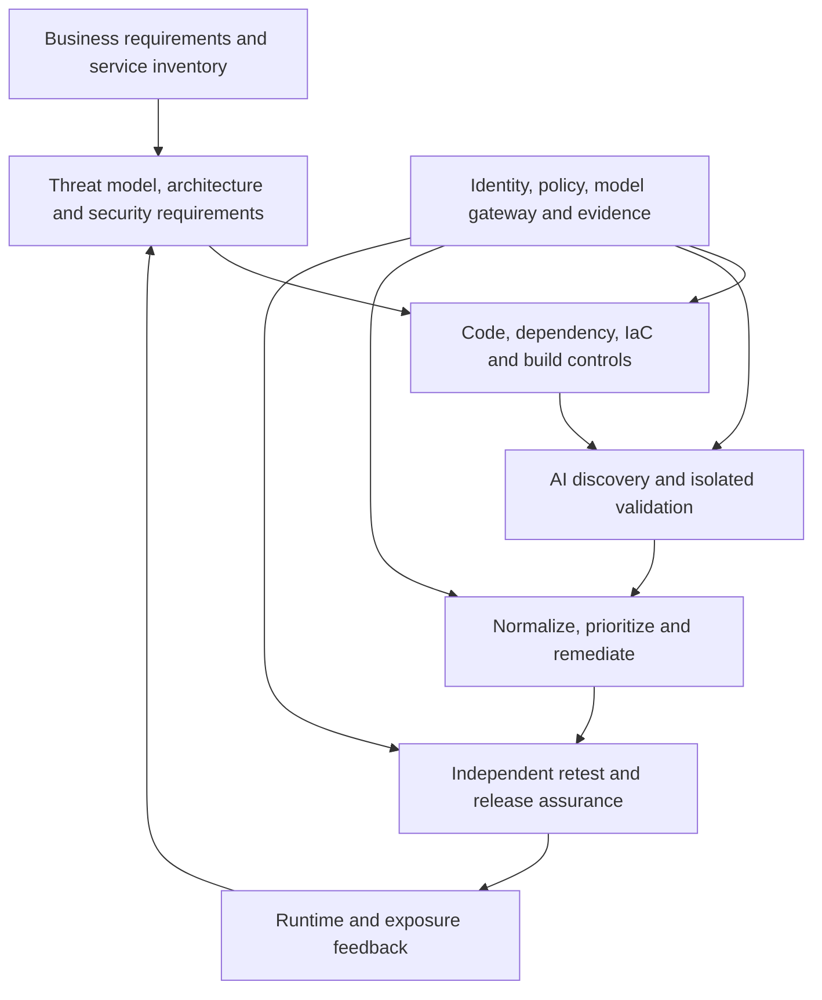

# AI-Native Application Security Strategy for a Financial Market Infrastructure

**Version:** 0.1 | **Date:** 23 September 2026 | **Status:** Proposed strategy for CIO, CISO, engineering, architecture, risk and audit review  
**Horizon:** 2026–2031 | **Source prompt:** [AI-CICD-Prompt](../Prompts/AI-CICD-Prompt.md)  
**Companions:** [Architecture option pack](01-architecture-option-pack.md), [ARB checklist](02-arb-review-checklist.md), [Open decisions](03-open-decisions.md)

> This is a target architecture and investment hypothesis, not an assertion that a named vendor has passed procurement or that a particular entity is designated under Hong Kong Cap. 653. Product capabilities and legal applicability require validation against the actual estate and current contracts.

## 1. Executive decision

Adopt an **evidence-driven software assurance platform**: machine-readable application and dependency inventory, continuously updated threat and trust-boundary models, cheap deterministic controls, independent AI-assisted discovery, isolated reproduction, risk-based remediation, independently checked patches, controlled release, and runtime feedback. An agent may propose a finding or fix; it does not certify its own work, accept risk, or authorize production deployment. The enterprise owns the decision and evidence chain.

The recommended 2027–28 transition is a **hybrid, strong AI-assisted model** with a common control plane and modular discovery tools. By 2030, automate bounded and reversible investigation and maintenance; keep named human approval at material change and risk boundaries. Fully autonomous production change is a research option, not the default target for an FMI.

The decisive investment is a common **asset/architecture graph plus policy and evidence spine**, joining source, build, SBOM, identity, data flows, exposure, findings, releases and incidents. Purchasing another scanner without this join increases queues. Existing deterministic scanning remains useful because it is cheap, reproducible and sometimes legally or contractually necessary; the *ticket-per-alert operating model* is what must end.

### Decisions requested

1. Fund a 90-day baseline and two-repository pilot; nominate one customer-facing and one critical internal workflow with owners and safe test environments.
2. Assign platform engineering to the identity, sandbox, policy and evidence spine; AppSec owns the validation standard; business owners own risk decisions.
3. Approve a bounded autonomy policy: read-only discovery and draft patches by default; no direct agent merge, production credential, risk acceptance or regulatory attestation.
4. Require evidence of improvement in **validated risk removed per reviewer-hour and cost**, rather than finding count, before scaling.

## 2. Assumptions and economic test

The prompt's scenarios—2× applications, 10× releases, 20× AI-generated code, under 20% security headcount growth—are **stress-test inputs, not forecasts**. The useful question is whether cost and residual risk grow with code volume. One shared control evaluation per changed component, coupled with risk-triggered deep tests, scales better than a manual sign-off for every release. AI code share, attack automation maturity and product readiness may develop more slowly; architecture must still work with conventional tooling and model outage.

For each control capture monthly licence/cloud/compute plus integration and reviewer hours. Calculate **cost per actionable finding** = total operating cost / independently confirmed, distinct findings that warrant action; **cost per remediated risk** = total cost / confirmed fixes independently retested; and **friction** = added lead time at P50/P95. Report severity- and exposure-weighted outcomes separately. Do not equate prevented incidents to scanner detections; use controlled baselines and incident escape trends.

| Control family | Cost/failure under 10× releases | Adversarial evolution | Future state |
|---|---|---|---|
| Threat modelling, architecture and secure design reviews | Manual full review becomes queue; static diagrams miss code and cloud drift | Automated actors chain data-flow and authorization mistakes | Continuous graph/diff with human design review at new trust boundaries and material change |
| SAST, SCA, secret, IaC and container scanning | Low marginal compute, high triage if raw alerts become tickets | Attackers exploit reachable paths, packages and leaked credentials faster | Keep deterministic baseline, normalize and validate; auto-rotate verified leaks; evidence-linked exceptions |
| DAST, IAST and API tests | Environment and coverage cost; scripted checks miss business logic | Multi-step authenticated abuse | Targeted, instrumented tests against safe clones and known abuse cases |
| Pen testing, PTaaS and red teaming | Periodic scope cannot cover growing estate | Attack chaining becomes continuous | Human-led independent challenge for novel logic, high-impact releases and control bypass; continuous bounded exercises complement it |
| Vulnerability management and sign-off | Ticket and meeting volume grows linearly; duplicate noise hides urgency | Exploit windows shorten | Evidence-based case management, policy gates and time-bound owner decisions; eliminate blanket approval meetings |

**Residual risk:** AI can invent a proof, miss a novel abuse path, overfit tests, poison its own context, or produce a correct patch to the wrong requirement. A reproducible exploit in a clone is strong evidence but not proof that production is exposed; absence of a reproduced exploit is not proof of safety. High-consequence unproven design concerns remain in a separate, explicitly reviewed investigation queue rather than being discarded to satisfy a validation metric.

## 3. Target architecture and trust boundaries

| Layer | Inputs → outputs | Human responsibility | Automation responsibility |
|---|---|---|---|
| Business and inventory | Product criticality, data classification, service owner → tier and scoped inventory | Approve criticality and impact | Discover repos, services and owners; flag orphan assets |
| Threat model and architecture | Data flows, trust boundaries, identity, dependencies → abuse cases and requirements | Sign off novel boundary and resilience design | Detect design drift; propose abuse cases and diagrams |
| Deterministic assurance | Commit, lockfiles, IaC, images, build → reproducible findings, SBOM and provenance | Own exceptions and tuning | Run SAST/SCA/secrets/IaC/container checks and policy gates |
| AI discovery | Read-only source and architecture context → hypotheses | Define safe scope and business semantics | Reason over cross-component logic, auth and reachability |
| Validation | Hypotheses and safe fixtures → traces, reproducible tests, counterexamples | Authorize intrusive testing and resolve uncertain high-impact cases | Use separate identity/model plus ephemeral sandbox; verify and deduplicate |
| Risk and remediation | Evidence, exploitability, service tier → case, patch PR and tests | Set priority, review fix and accept residual risk | Rank, suggest patch, generate regression tests and update design artifacts |
| Retest and release | Patch, tests, signed build → independent verification and deployment decision | Approve material merge and production promotion | Rebuild, rescan, fuzz as relevant, check provenance and rollback |
| Runtime and exposure | Telemetry, attack surface, incidents → revised priority and models | Direct response and systemic remediation | Correlate exposure, detect drift and feed learning loop |
| Governance and evidence | Every policy/action/approval → immutable, access-controlled trace | Set policy, retention, assurance and attestations | Sign events, record versions and decisions, monitor agents and costs |

**Implementation boundary:** untrusted PR text, repository comments, packages and retrieved web content are data, never instructions to an agent. The model gateway applies data classification, redaction, provider restrictions, retention and cost budgets. Agent workloads get short-lived scoped identities; source readers cannot write, validators cannot access production or sign their own hypotheses, and patch agents cannot merge. Validation sandboxes use synthetic/test data, isolated network egress, disposable credentials and resource limits. Store hashes and references to sensitive prompts/context where full retention would leak secrets; preserve enough records to reproduce a decision under approved access.

The evidence event schema includes `service_id`, source commit, artifact digest, SBOM/provenance references, policy and prompt/model version, actor and delegation ID, finding fingerprint, reproduction trace, confidence rationale, reviewer/decision, expiry, retest result and deployment ID. Use open interchange formats where useful (SARIF, SPDX/CycloneDX, OCI attestations); confirm compatibility in procurement.

**Availability:** a model or exploratory agent outage degrades to deterministic gates and an explicit manual review path. A policy, signing or required evidence service outage blocks protected promotion unless a named emergency authority invokes a logged, expiring break-glass process. Test both failure modes and recovery; avoid a single central AI service becoming the release path's availability dependency.

## 4. Finding lifecycle and autonomy

1. **Discover:** collect hypotheses from scanners, agents, incidents and humans. Preserve the original result, model/prompt version and service context.
2. **Validate:** independently replay in a safe clone or establish a deterministic configuration/dependency proof. Initial policy: high-confidence ticket requires a reproducible trace or verifiable rule, affected commit, impacted asset and owner; confidence scores are calibrated on a labelled local corpus, not interpreted as probabilities without calibration. Suggested admission threshold is precision ≥80% in pilot cohorts; never suppress credible high-consequence unproven issues solely because no exploit can safely be demonstrated.
3. **Normalize/prioritize:** collapse duplicates by root cause and affected version; weigh business impact, data sensitivity, reachable exposure, exploit preconditions, runtime controls and patch blast radius. Open one action case per root cause; park low-risk/no-action outcomes in an evidence register with review date.
4. **Remediate:** propose a minimal patch and independent negative and positive tests; human owner reviews semantics. An agent-authored test alone cannot establish correctness of an agent-authored fix.
5. **Retest/learn:** rebuild from pinned source, rerun the reproduction and relevant security/regression suites, verify deploy digest and telemetry, then close with reviewer identity. Incidents and misses update the corpus, threat model and policy via reviewed pull requests.

| Activity | Autonomy ceiling | Approval and evidence |
|---|---|---|
| Read-only indexing, scan, draft threat model or patch | Autonomous within registered scope | Actor, scope, model and version logged |
| Safe sandbox reproduction and test execution | Autonomous for pre-approved classes; human approved for intrusive cases | Sandbox logs, target allowlist, test data and expiry |
| Merge low-risk maintenance patch | Human approved in initial phases; reconsider only after measured safety and rollback | Independent tests, named code owner and signed provenance |
| Production promotion, material auth/payment change | Human approved | Two-person separation where required, release and rollback evidence |
| Risk acceptance, regulatory attestation, disclosure to third parties | Human only | Named authority, rationale, expiry and audit record |

**Workflows:** new code follows requirements → risk tier → changed-boundary review → deterministic checks → AI hypotheses → independent validation → patch/PR → independent tests → owner approval → signed release → runtime learning. Existing vulnerability follows discovery → proof or documented uncertainty → dedupe → asset-context ranking → owner action → retest → closure. Emergency fix follows incident commander escalation → bounded proposed patch → essential independent tests → named emergency approval → monitored canary/rollback → retrospective review.

## 5. Capability and technology strategy

The following is a **market evaluation shortlist**, not a claim of verified feature parity. In a proof of value, test each candidate on the same blind corpus of auth, business logic, dependency, IaC and cross-service cases. Capture discovery, independent reproduction, deduplication, patch PR and retest rates **per product**, plus cost, deployment model, audit export, data residency, private-model support and segregation of duties. Published demos cannot establish these properties. A platform that only emits more tickets fails the economic gate.

| Layer and posture | Named technologies to assess | Verification question |
|---|---|---|
| Core deterministic, portable | CodeQL, Semgrep; Syft, Grype, Trivy; Gitleaks, TruffleHog; Checkov, Terrascan; OWASP ZAP; AFL++, libFuzzer, Honggfuzz | Coverage, reproducibility, supported languages, runtime cost, SARIF/SBOM export and maintenance |
| Optional commercial code and ASPM | Black Duck Signal/Polaris, Apiiro, Wiz Code, Contrast, Veracode, Checkmarx, Snyk, SonarQube AI, Fortify | Can one asset graph reconcile findings, ownership, exploitability, fixes and evidence without lock-in? |
| Optional exposure and independent human tests | Pentera, Horizon3 NodeZero, AttackIQ, SafeBreach, Picus; Synack, Cobalt, HackerOne, Bugcrowd, NetSPI, BreachLock | Safe scope, proof, repeatability, specialist logic coverage, rollback, and regulator-usable evidence |
| Experimental or vendor-dependent AI systems | Microsoft MDASH, Security Exposure Management, AI Code Security, Defender Agentic Security, Project Perception, Security FORGE; Google Mantis, CodeMender, OSS-Fuzz, ClusterFuzz, ClusterFuzzLite, Big Sleep, Gemini Security Agents | Verify existence, availability, licensing, integration, autonomy, validation independence and data handling directly; research announcements are not production controls |

For each product record a lifecycle funnel: raw → distinct → verified true → actionable → remediated → independently retested, with false-positive, duplicate, low-risk, non-exploitable and previously-known counts. Compare against current tools and a no-new-platform baseline. Never infer deployment readiness, on-prem support or private-LLM support merely from a brand association. Prioritize a replaceable control spine and open interfaces over an end-to-end vendor promise.

| Capability | Maturity target | Adoption decision |
|---|---|---|
| Repository/service inventory, secret detection, SBOM and signed build | Current | Core control; close coverage gaps now |
| Contextual finding deduplication and risk ranking | Emerging | Pilot with audit trails and reversible decisions |
| AI threat-model drift, cross-service logic discovery, patch PR | Emerging | Advisory and scoped pilot; compare to human baseline |
| Independently validated bounded agent investigation | Emerging | Isolated pilot after identity and sandbox gates |
| Autonomous production remediation or self-attestation | Future/uncertain | No default FMI deployment; research only |

## 6. Attacker model and adversarial design review

| Threat | Likely near-term effect | Defensive test |
|---|---|---|
| AI-assisted code and dependency reasoning | Faster discovery and chaining of reachable defects | Cross-service graph and exploit-path exercises |
| Prompt injection through PRs, issues, source comments or dependencies | Agent exfiltration, scope change or malicious patch | Poisoned-context regression suite and enforced tool permissions |
| Automated business-logic abuse and credential misuse | Repeated low-noise fraud or privilege escalation | Abuse-case fixtures, rate limits, transaction monitoring and human scenario review |
| Compromised CI/agent identity or model supplier | False evidence, poisoned fixes and supply-chain propagation | Scoped identity, independent signer, provenance, model/provider exit exercise |

**Adversarial challenges:** an offensive researcher will exploit blind spots in synthetic clones; require production-observed context and periodic human tests. A nation-state actor will target the model gateway or evidence signer; isolate trust roots and test recovery. A ransomware actor will poison patch queues; enforce code-owner review and rollback. An auditor will reject unverifiable model confidence; show primary traces and policy versions. A regulator will challenge delegated accountability; name an accountable business owner and attestator. A developer will bypass a slow gate; set P95 budgets and graceful degradation. An application owner will contest risk ranking; allow reasoned overrides with expiry. Microsoft/Google-scale defenders and AIxCC researchers would challenge monoculture, benchmark overfitting and self-validation; use independent engines, blind local corpora and rotating red-team tests. These are design challenges, not claims about specific organizations' views.

## 7. Operating model and RACI

**RACI key:** R performs, A owns the outcome, C consulted, I informed. AI agents execute delegated tasks but are never the accountable party.

| Decision or activity | Engineering owner | Platform | AppSec / security architecture | Risk / audit | SOC / incident lead | Enterprise architecture |
|---|---|---|---|---|---|---|
| Service tier and security requirements | A/R | I | C | C | I | C |
| Agent identity, gateway, sandbox, evidence | C | A/R | C | C | I | C |
| Threat model and material design approval | R | C | A | C | C | C |
| Finding validation standard and triage | R | C | A/R | I | C | I |
| Patch correctness, merge and release | A/R | R | C | I | I | I |
| Material residual-risk acceptance | R | I | C | A | C | I |
| Security incident containment | C | R | C | I | A/R | I |
| Control testing and regulatory evidence | C | R | C | A/R | C | I |

Human activities: engineers own functionality and fixes; platform engineers own safe execution and policy availability; security architects own design requirements; AppSec owns validation quality; SOC owns incident actions; enterprise architecture owns interoperability; risk and internal audit independently assess control operation. AI may draft, correlate and test within each team's mandate. Assign individual named approvers in the actual RACI before rollout; an organizational role is insufficient audit evidence.

### Agent catalogue

| Agent | Input → output | Trust and autonomy | Approval trigger |
|---|---|---|---|
| Threat/design | Approved diagrams, data classification → proposed abuse cases | Read-only, untrusted context | New boundary or changed critical flow |
| Code/auth/business-logic discovery | Source, policy, test fixtures → hypotheses | Read-only, no secret access | Expansion of scope |
| PoC/fuzz validator | Hypotheses, disposable build → reproducible trace | Separate identity in isolated sandbox | Intrusive test or external target |
| Patch/test/docs | Verified case → PR, tests, documentation | Write to branch only | Merge, new dependency or production change |
| Risk/evidence | Case and signed events → priority and audit packet | Read-only analysis, no attestation | Risk override or regulator submission |

## 8. Four architecture choices

Scores below are **relative hypotheses** (low/medium/high), not quantified risk-reduction promises. Validate with a common pilot and local costs.

| Option | Cost / complexity | Governance burden | Readiness | Likely benefit and principal risk |
|---|---|---|---|---|
| Conservative: deterministic scans plus manual reviews | Medium / low | Medium | High | Predictable evidence; queues grow with release volume and logic gaps persist |
| Progressive: AI triage and drafting | Medium / medium | Medium | Medium-high | Reduced review toil; automation bias and unverifiable summaries |
| Aggressive: independent discovery, validation and PR generation behind control spine **(recommended)** | High initial / high | High initial, lower steady-state per release | Medium after pilot | Better validated coverage and faster fixes; integration, sandbox and evidence failure modes |
| Autonomous: agents approve and promote releases | Uncertain / very high | Very high | Low for critical FMI | Potential speed, but correlated model errors and unclear assurance at irreversible boundaries |

The recommendation changes if platform identity, test coverage, asset ownership or safe clones are missing: begin with the progressive model while building those prerequisites. Keep explicit exit criteria for any pilot rather than committing to a product category in advance.

## 9. Regulatory and resilience alignment

Hong Kong's **Protection of Critical Infrastructures (Computer Systems) Ordinance (Cap. 653)** took effect on 1 January 2026. Its application depends on formal designation, relevant systems and directions from the regulating authority. Map actual obligations with counsel and the regulator; do not present this paper's controls as a statutory checklist. For designated scope, retain evidence of security management, assessment, incident response, changes, tests and responsible decisions in the form and period required by the applicable authority. Align with NIST SSDF secure-development outcomes and the NIST AI RMF Generative AI Profile for model risk; these are reference frameworks, not substitutes for local legal analysis.

For FMI resilience, prove that a failed agent/model cannot silently disable scanning or prevent emergency restoration. Exercise both malicious patch and bad-model rollback. Track transaction integrity, authorization and availability alongside confidentiality; a low-severity CVE in a central clearing path can outrank a nominally critical issue on a disconnected test service. Assess cryptographic inventory and post-quantum transition separately; an SBOM alone does not establish crypto agility.

## 10. Roadmap, gates and measures

| Window | Deliverables | Gate to proceed |
|---|---|---|
| 0–12 months | Inventory and tier two pilots; baseline reviewer hours, escaped defects and release latency; bind agent identity and model gateway; isolated validation; signed evidence schema; deterministic coverage; known-issue corpus | No production agent privilege; reproducible findings and independently tested sandbox; measured precision and cost |
| 12–24 months | Integrate ASPM/case normalization; pilot auth and business-logic agents; patch PRs, independent tests, design drift and runtime context; exercise provider outage | Improvement against baseline without worse escape rate or P95 delivery friction; audit can reconstruct a sampled decision |
| 24–36 months | Expand to critical services by tier; automate bounded maintenance; continuous safe exposure validation and feedback from incidents | Cross-team ownership, strong rollback, no unexplained evidence gaps, red-team challenges passed |
| 36–60 months | Mature policy-driven, replaceable assurance services; consider narrower autonomous merges only for proven low-impact classes | Independent safety study and approval by engineering, security, risk and regulator where relevant |

| Metric | Definition and interpretation |
|---|---|
| Discovery, validation, remediation time | Median and P95 elapsed time for confirmed material issues; stratify by severity and service tier |
| Escape rate | Confirmed exploitable defects first detected after production per 1,000 material changes; track detection bias |
| Precision and recall | Actionable verified cases / admitted cases; recall on seeded and historical blind corpus, not vendor claims |
| Cost and friction | Cost per independently retested fix, reviewer-hours per change, P95 release lead time and blocked-release duration |
| Evidence and governance | Percentage of sampled releases with complete signer, policy, approval and rollback trace; expired exceptions and unauthorized agent attempts |
| Resilience | Recovery time from gateway, policy and evidence failures; rate of successful fallback exercises |

Review metrics monthly and independently sample discarded or downgraded findings. A pilot passes only when improvement is demonstrated against an agreed baseline and safety constraints; numeric thresholds must be set from local distributions rather than copied from a vendor benchmark.

## 11. What changes by 2030

Traditional SAST, DAST and threat modelling are unlikely to disappear: reproducible code rules, active tests and human understanding of business intent still matter. They become callable services and continuously refreshed models rather than isolated annual activities. Generic PTaaS reports, raw vulnerability backlogs and blanket sign-off meetings are more likely to lose value when independent validation and risk-context routing mature. This is a forecast, not a purchasing instruction.

Security leaders commonly underinvest in asset ownership, independent proof and the ability to turn off a compromised agent. Vendors often optimize the count of detections instead of verified fixes and audit-quality evidence. **Inference:** major platform vendors may integrate code graph, exposure, patching and agent governance, but their precise roadmaps are unknown. Preserve competitive tension by specifying interfaces and evidence semantics before selecting products. The likely successor to today's Secure SDLC is a **continuous, identity-bound assurance system** around delivery and runtime, with people governing irreversible decisions.

## 12. Sources and review dependencies

- [Governing prompt](../Prompts/AI-CICD-Prompt.md) and [existing option pack](01-architecture-option-pack.md); this strategy uses the pack's discovery/validation separation, agent-principal and evidence principles, while testing a broader 2030 autonomy horizon.
- [ARB conformance checklist](02-arb-review-checklist.md) and [open decisions](03-open-decisions.md). Its Phase 0 assumptions, platform readiness and vendor scoring remain unresolved for this enterprise.
- [Hong Kong Cap. 653](https://www.elegislation.gov.hk/hk/cap653) and [commencement notice](https://www.info.gov.hk/gia/general/202506/27/P2025062700238.htm).
- [NIST Secure Software Development Framework](https://csrc.nist.gov/projects/ssdf) and [NIST AI Risk Management Framework](https://www.nist.gov/itl/ai-risk-management-framework).
- [OWASP guidance on agentic threats](https://genai.owasp.org/resource/agentic-ai-threats-and-mitigations/).

**Next architecture decisions:** determine designation and obligations; select pilot services; validate service inventory and licence estate; choose control-plane build/buy boundaries; set data classifications and model residency; agree evidence retention with legal; ratify autonomy policy and pilot pass criteria. Record each as an owned, dated decision before production adoption.
